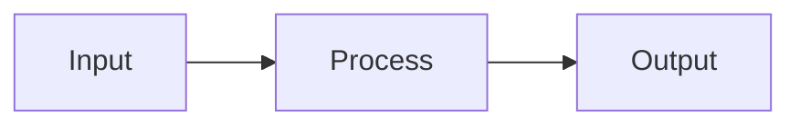

# Writing Documentation

Write clear, scannable, accurate project documentation. Covers READMEs, feature
docs, guides, and technical references.

## Before Writing

1. **Read the existing docs** — understand current structure, tone, and coverage.
2. **Read the code** — documentation must match what the code actually does,
   not what it was supposed to do. Grep for key interfaces, defaults, and CLI
   flags. If the README says the default is X, verify it in the code.
3. **Identify the audience** — developers using the tool? Contributors? Both?
   This determines depth and assumed knowledge.

## README Structure

Follow this order. Skip sections that don't apply, but keep the order stable:

```
1. Header (logo, title, tagline, badges, nav links)
2. One-liner description — what this project does in one sentence
3. Table of Contents (collapsible, for long READMEs)
4. Why / Motivation — what problem it solves, why it exists
5. Quick Start (prerequisites, install, first run)
6. How It Works — architecture, key concepts, diagrams
7. Configuration — settings, env vars, examples
8. API Reference — endpoints, CLI commands, interfaces
9. Development — setup, testing, contributing
10. Built With — key technologies
11. License
```

## Writing Rules

**Accuracy over everything.** Every claim must be verifiable in the code. If a
diagram shows component names, they must match the actual class/file names. If
a table lists defaults, they must match the actual defaults in config.

**Scannable.** Readers skim. Use:
- Short paragraphs (2-3 sentences max)
- Bold lead-ins for key concepts: **Daemon-centric** — description...
- Tables for structured data (config, API endpoints, comparisons)
- Code blocks for anything the user types or sees
- Mermaid diagrams for architecture and flows

**Show, don't tell.** Prefer a code example over a paragraph of explanation:

```
# Bad
The submit endpoint accepts a JSON payload with a prompt field.

# Good
curl -X POST http://localhost:8081/api/submit \
  -H "Content-Type: application/json" \
  -d '{"prompt": "Add retry logic"}'
```

**DRY.** Don't repeat information across sections. Reference other sections
instead: "See [Configuration](#configuration) for all options."

**No filler.** Cut phrases like "It should be noted that", "In order to",
"As mentioned above". Say the thing directly.

## Diagrams

Use Mermaid for architecture and flow diagrams. Keep them simple — 5-10 nodes
max. If a diagram needs more, split it.



Good diagram practices:
- Label nodes with actual component names from the code
- Show data flow direction with arrows
- Use subgraphs to group related components
- Add brief annotations on edges for non-obvious transitions

## Tables

Use tables for:
- Configuration options (Setting | Default | Description)
- API endpoints (Endpoint | Method | Description)
- Comparisons (Feature | Option A | Option B)
- Component summaries (Name | Purpose | Key detail)

Always include a header row. Align columns for readability in source.

## GitHub-Specific Best Practices

- **Badges** — Python version, license, build status. Place after title.
- **Collapsible sections** — Use `<details>` for long content (project layout, advanced config).
- **Relative links** — Link to files in the repo: `[config example](config.yaml.example)`.
- **Anchors** — Use `[section](#section-name)` for internal navigation.
- **Code fence languages** — Always specify: ` ```bash `, ` ```python `, ` ```yaml `.

## Updating Existing Docs

When updating (not creating from scratch):
1. Read the full existing document first
2. Identify what's stale, missing, or inaccurate
3. Make surgical edits — preserve existing structure and tone
4. Verify every factual claim against the code
5. Check that diagrams, tables, and examples still match reality

## Checklist Before Finishing

- [ ] Every default value verified against code
- [ ] Every component/class name matches actual code
- [ ] All code examples are runnable (correct flags, paths, syntax)
- [ ] Diagrams use actual component names, not placeholder names
- [ ] No orphan sections (everything linked from TOC or nav)
- [ ] Prerequisites listed (language version, CLI tools, etc.)
- [ ] Consistent formatting (heading levels, bold patterns, list styles)
