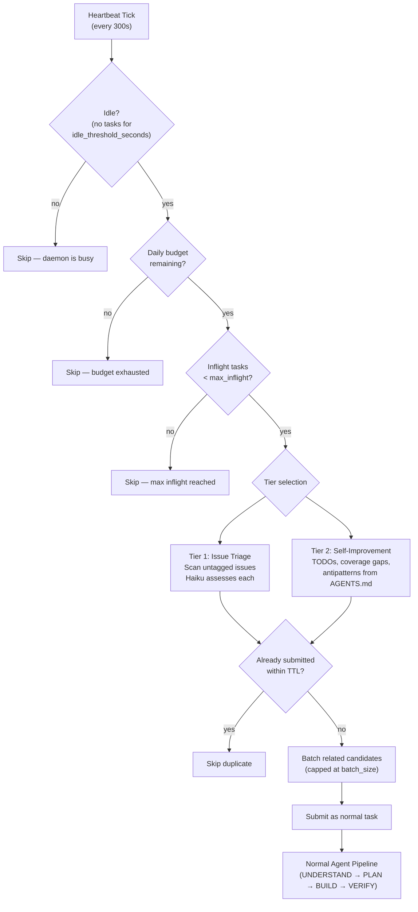
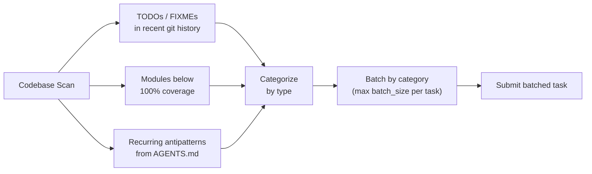
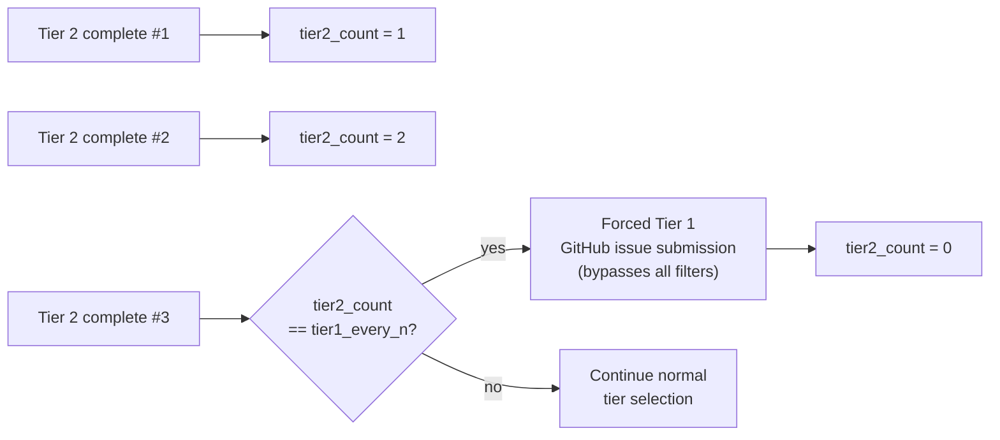

# Heartbeat

> [!NOTE]
> Heartbeat is disabled by default. Enable it with `heartbeat_enabled: true`
> in `config.yaml` or `golem config set heartbeat_enabled true`.

When the daemon is idle (no external tasks for 15 minutes by default), Golem
starts looking for work on its own. This autonomous self-improvement system is
called the **Heartbeat**. It operates at two tiers: triaging untagged issues
from your issue tracker (Tier 1) and improving the codebase itself (Tier 2).

See also: [[Architecture]] for the system overview, [[Task Lifecycle|Task-Lifecycle]]
for how heartbeat-submitted tasks flow through the pipeline.

---

## Overview

The heartbeat fires on a configurable interval (default: every 5 minutes) and
checks whether the daemon has been idle long enough to activate. When idle, it
scans for candidate work, batches related items, and submits them as normal
Golem tasks — they flow through the same pipeline as any externally-submitted
task.



---

## Tier System

### Tier 1 — Issue Triage

Tier 1 scans your configured task source (GitHub Issues, Redmine, etc.) for
issues that have not yet been tagged for automation. Each candidate is passed
to a Haiku session that assesses three dimensions:

| Dimension | What it measures |
|-----------|----------------|
| **Automatability** | Can this be done without human judgment? |
| **Confidence** | How certain is the assessment? |
| **Complexity** | trivial / standard / complex |

Candidates below the confidence threshold are skipped — Golem will not attempt
tasks where it is uncertain whether automation is appropriate. Passing
candidates are submitted as normal tasks with the full agent pipeline.

### Tier 2 — Self-Improvement

Tier 2 scans the codebase for actionable improvements when no external issues
are available:



Related candidates are **batched by category** — for example, all
`empty-exception-handler` antipatterns are grouped into a single task rather
than submitted as individual tasks. This reduces orchestration overhead and
allows the agent to apply consistent fixes across the entire codebase in one
pass. Batches are capped at `heartbeat_batch_size` (default: 5) candidates
per submission.

---

## Tier 1 Promotion

Left unchecked, the heartbeat could run indefinitely on Tier 2 self-improvement
tasks and never pick up real feature work from the issue tracker. Tier 1
promotion prevents this:

After every `heartbeat_tier1_every_n` successful Tier 2 completions (default:
3), the heartbeat **forces a GitHub issue submission**, bypassing all filters:

- No budget check
- No inflight limit check
- No complexity filter

The promoted task runs as a normal Golem task through the real state backend,
so issue close/comment updates reach the tracker. It is not tracked in the
heartbeat inflight counter to avoid blocking subsequent heartbeat ticks.



---

## Deduplication

Heartbeat candidates are deduplicated to prevent submitting the same fix
repeatedly across multiple idle periods.

- **TTL** — configurable, default 30 days. A candidate seen within the TTL
  window is skipped regardless of tier.
- **Persistence** — dedup memory, inflight task IDs, and daily spend are
  persisted to `data/heartbeat_state.json`. The state is loaded on daemon
  startup, so deduplication survives restarts.
- **Cross-detection dedup** — the detection loop and heartbeat share a dedup
  layer. `poll_new_items()` checks heartbeat's claimed issue IDs before
  spawning, preventing duplicate agent sessions for the same GitHub issue.

The `data/heartbeat_state.json` file contains:

```json
{
  "dedup_seen": {
    "candidate-hash-abc123": "2026-03-01T12:00:00Z"
  },
  "inflight_task_ids": ["task-456"],
  "daily_spend_usd": 0.42,
  "daily_spend_date": "2026-03-28",
  "tier2_completion_count": 1
}
```

---

## Configuration

| Setting | Default | Description |
|---------|---------|-------------|
| `heartbeat_enabled` | `false` | Enable self-directed work when idle. Must be explicitly set to `true`. |
| `heartbeat_interval_seconds` | `300` | How often the heartbeat tick fires (5 min). |
| `heartbeat_idle_threshold_seconds` | `900` | How long the daemon must be idle before heartbeat activates (15 min). |
| `heartbeat_daily_budget_usd` | `1.0` | Daily spend cap for heartbeat-spawned tasks. Resets at midnight. |
| `heartbeat_max_inflight` | `1` | Maximum concurrent heartbeat tasks. Prevents runaway self-improvement. |
| `heartbeat_candidate_limit` | `5` | Maximum candidates evaluated per scan. |
| `heartbeat_batch_size` | `5` | Maximum Tier 2 candidates per batched task submission. |
| `heartbeat_tier1_every_n` | `3` | Force a Tier 1 GitHub issue submission after this many Tier 2 completions. |
| `heartbeat_dedup_ttl_days` | `30` | Deduplication memory TTL in days. Candidates within this window are skipped. |

```bash
# Enable heartbeat
golem config set heartbeat_enabled true

# Increase idle threshold to 30 minutes
golem config set heartbeat_idle_threshold_seconds 1800

# Check current heartbeat settings
golem config get heartbeat_enabled
golem config list | grep heartbeat
```

The heartbeat state is visible in the web dashboard under the Config tab. The
`/api/live` endpoint includes the current heartbeat activation status in the
daemon health snapshot.

---

## State Cleanup on Detach

Each attached repo has its own per-repo state file stored under
`data/heartbeat/<path_hash>.json`. When a repo is detached (via
`golem repo detach <path>`), the `HeartbeatManager` saves the worker's
current state to disk before removing it. The state file is preserved on
disk; no automatic deletion occurs. The worker is recreated (and state
reloaded) if the same repo is re-attached later.
