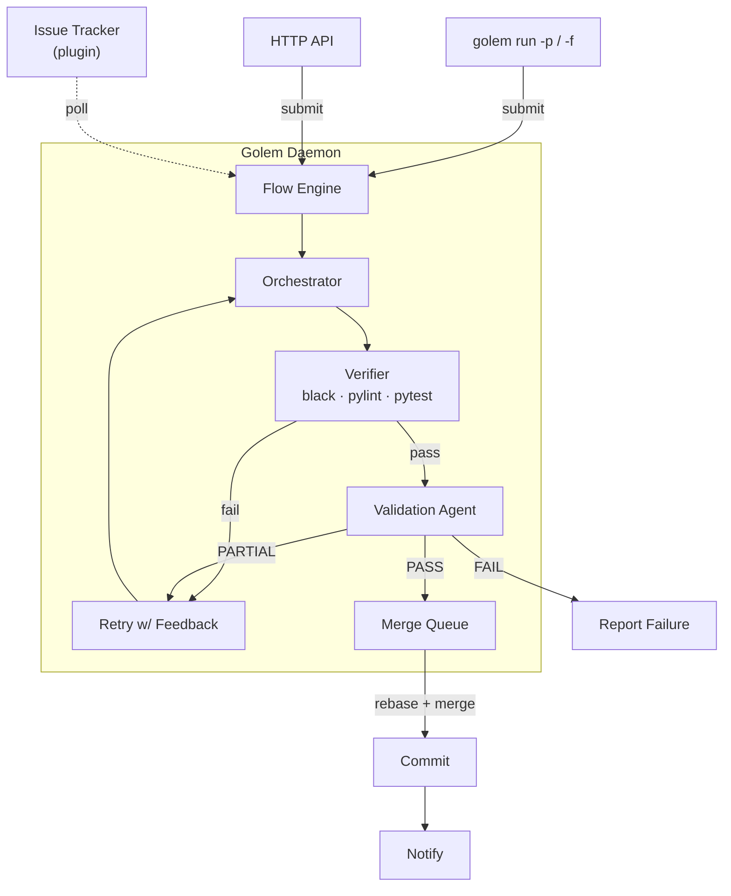

<p align="center">
  
</p>

<h1 align="center">Golem</h1>

<p align="center">
  <strong>An autonomous AI agent that picks up tasks, executes them, and delivers results — no human in the loop.</strong>
</p>

<p align="center">
  
</p>

<p align="center">
  <a href="https://www.python.org/downloads/"></a>
  <a href="https://opensource.org/licenses/MIT"></a>
  <a href="https://github.com/itsmeboris/Golem/wiki"></a>
  <a href="https://star-history.com/#itsmeboris/golem&Date"></a>
  <a href="https://docs.anthropic.com/en/docs/claude-code"></a>
</p>

<p align="center">
  <a href="#quick-start">Quick Start</a>&nbsp;&nbsp;·&nbsp;&nbsp;
  <a href="#why-golem">Why Golem</a>&nbsp;&nbsp;·&nbsp;&nbsp;
  <a href="#how-it-works">How It Works</a>&nbsp;&nbsp;·&nbsp;&nbsp;
  <a href="https://github.com/itsmeboris/Golem/wiki">Wiki</a>&nbsp;&nbsp;·&nbsp;&nbsp;
  <a href="CONTRIBUTING.md">Contributing</a>
</p>

---

Golem runs as a daemon, picks up work from your issue tracker or direct prompts, spins up Claude agents, validates the output, commits the results, and notifies your team — in a continuous loop.

Submit a prompt. Walk away. It's done.

---

## Why Golem

Most AI coding tools wait for you to invoke them. Golem runs the other way around.

**Daemon-centric** — Everything runs through the daemon. Submit a prompt from the CLI, drop a file, or hit the HTTP API — the daemon picks it up, executes it in the background, and reports back.

**Parallel execution** — Multiple Claude instances run simultaneously, each in its own git worktree. Validated work merges cleanly through a sequential merge queue.

**Deep quality pipeline** — Every task passes through deterministic verification (`black`, `pylint`, `pytest`), AST-based structural analysis, coverage delta on changed files, documentation relevance checks, and a separate validation agent review. Only fully validated work gets committed.

**Budget guardrails** — Per-task dollar limits and timeouts. A one-liner fix won't accidentally burn $50 in API calls.

**Pluggable everything** — Swap Redmine for GitHub Issues, Teams for Slack, or write your own backend — without touching core logic.

---

## Who Is This For?

**Developers using Claude Code who want it to work autonomously.** If you're already paying for Claude and find yourself running the same "edit → test → fix → commit" loop, Golem automates that entire cycle.

- **Solo developers** — submit a prompt, work on something else, come back to committed code
- **Small teams** — assign tasks to Golem via your issue tracker, get notified when they're done
- **AI/LLM enthusiasts** — a real-world autonomous agent with validation, not a demo or benchmark

## How Is This Different?

| | Interactive tools | Autonomous agents | **Golem** |
|---|---|---|---|
| **Mode** | You drive | Agent drives | **Agent drives** |
| **Execution** | Single session | Single session or cloud | **Daemon + parallel worktrees** |
| **Validation** | Manual review | Internal / benchmarks | **black + pylint + pytest + AST + review agent** |
| **Budget control** | None | Varies | **Per-task dollar limit** |
| **Merge workflow** | Manual | Patch / internal | **Rebase + merge queue + integrity check** |

---

## Quick Start

### Prerequisites

- **Python 3.11+**
- **[Claude CLI](https://docs.anthropic.com/en/docs/claude-code)** — Golem wraps Claude Code as a subprocess. Install it first and verify `claude --version` works.
- **Git** — for worktree isolation and merge operations.

### Cost

Golem requires **Claude CLI** with a paid Anthropic plan (Claude Pro or API access). Typical task costs:

| Task type | Typical cost | Typical time |
|-----------|-------------|-------------|
| Simple bug fix | $0.50–$1.00 | 1–3 min |
| New feature / endpoint | $1.00–$3.00 | 2–5 min |
| Complex refactor | $3.00–$8.00 | 5–15 min |

The `budget_per_task_usd` setting (default: $10) caps spend per task.

### 1. Install

```bash
git clone https://github.com/itsmeboris/golem.git && cd golem
pip install -e .
```

### 2. Configure

```bash
golem init                             # interactive wizard
# or manually:
cp config.yaml.example config.yaml     # tweak settings
```

<details>
<summary><strong>GitHub Issues setup</strong></summary>

```bash
gh auth login                          # authenticate the gh CLI
golem init                             # select "github" profile, enter owner/repo
```

Or set it manually in `config.yaml`:

```yaml
profile: github
projects:
  - owner/repo
detection_tag: golem                   # label on issues Golem should pick up
```

Golem assigns issues to itself on pickup, closes them on completion, and creates a PR for each committed task.

</details>

### 3. Run

```bash
# Submit a prompt — daemon starts automatically if not running
golem run -p "Refactor the logging module to use structured JSON"

# Submit from a file
golem run -f plan.md

# Check what's running
golem status

# Launch the web dashboard
golem dashboard --port 8081
```

For a full walkthrough with expected output, see the **[Getting Started](https://github.com/itsmeboris/Golem/wiki/Getting-Started)** wiki page.

---

## How It Works



Tasks flow through a state machine: **DETECTED → RUNNING → VERIFYING → VALIDATING → COMPLETED** (or RETRYING / FAILED). Each task runs in an isolated git worktree with its own Claude instance. Validated work enters a sequential merge queue that rebases onto HEAD — your working tree is never touched.

---

## Documentation

| Resource | Description |
|----------|-------------|
| **[Wiki](https://github.com/itsmeboris/Golem/wiki)** | Comprehensive guides — getting started, configuration, CLI, dashboard, troubleshooting, architecture, and more |
| **[Architecture](docs/architecture.md)** | Technical deep-dive — task lifecycle, agent pipeline, profiles, HTTP API |
| **[Operations](docs/operations.md)** | Operational reference — heartbeat, self-update, health monitoring, config management |
| **[Contributing](CONTRIBUTING.md)** | Development setup, project layout, coding conventions, testing |
| **[Changelog](CHANGELOG.md)** | Release history |

---

## License

MIT
