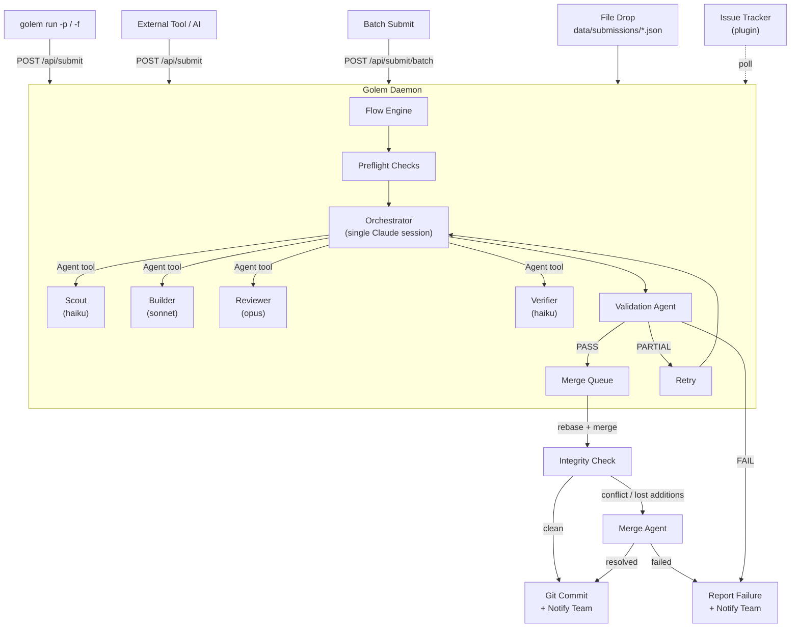
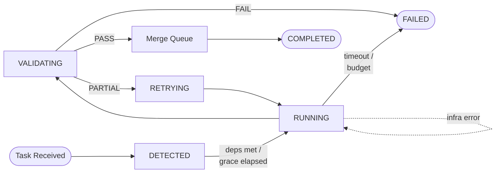
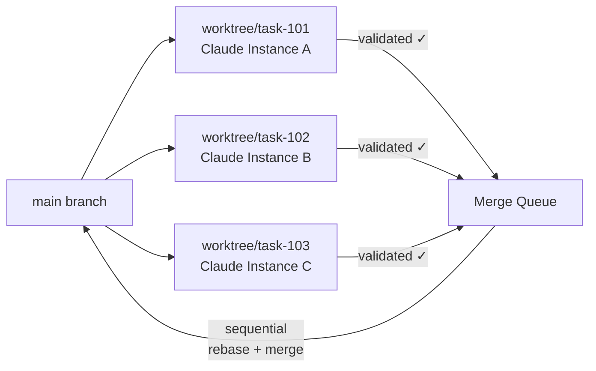
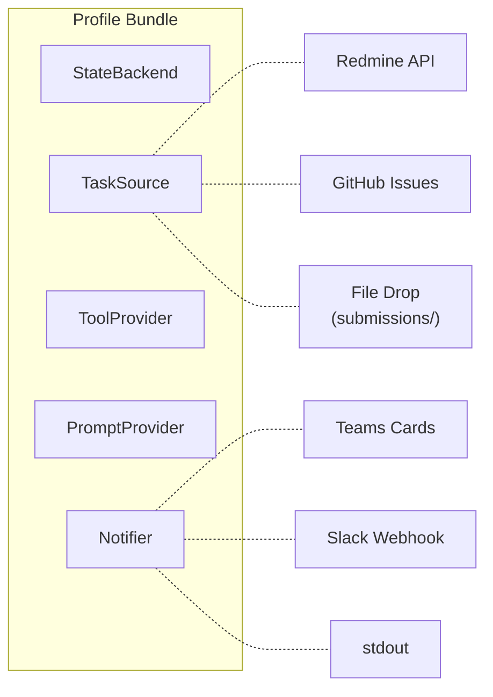

<p align="center">
  
</p>

<h1 align="center">Golem</h1>

<p align="center">
  <strong>An autonomous AI agent that picks up tasks, executes them, and delivers results — no human in the loop.</strong>
</p>

<p align="center">
  <a href="https://www.python.org/downloads/"></a>
  <a href="https://opensource.org/licenses/MIT"></a>
  <a href="#quick-start"></a>
</p>

<p align="center">
  <a href="#quick-start">Quick Start</a>&nbsp;&nbsp;·&nbsp;&nbsp;
  <a href="#why-golem">Why Golem</a>&nbsp;&nbsp;·&nbsp;&nbsp;
  <a href="#how-it-works">How It Works</a>&nbsp;&nbsp;·&nbsp;&nbsp;
  <a href="#agent-intelligence">Agent Intelligence</a>&nbsp;&nbsp;·&nbsp;&nbsp;
  <a href="#configuration">Configuration</a>&nbsp;&nbsp;·&nbsp;&nbsp;
  <a href="#http-api">HTTP API</a>
</p>

---

Golem runs as a daemon, picks up work from your issue tracker or direct prompts, spins up Claude agents, validates the output, commits the results, and notifies your team — in a continuous loop.

Submit a prompt. Walk away. It's done.

---

<!-- TABLE OF CONTENTS -->
<details>
<summary><strong>Table of Contents</strong></summary>

- [Why Golem](#why-golem)
- [Quick Start](#quick-start)
  - [Prerequisites](#prerequisites)
  - [Install](#1-install)
  - [Configure](#2-configure)
  - [Run](#3-run)
- [How It Works](#how-it-works)
  - [Daemon-Centric Architecture](#daemon-centric-architecture)
  - [Submitting Tasks](#submitting-tasks)
  - [Task Lifecycle](#task-lifecycle)
  - [Parallel Tasks & Git Worktrees](#parallel-tasks--git-worktrees)
- [Agent Intelligence](#agent-intelligence)
  - [5-Phase Workflow](#5-phase-workflow)
  - [Specialized Subagents](#specialized-subagents)
  - [Skill Discovery](#skill-discovery)
- [Architecture](#architecture)
  - [Profile System](#profile-system)
  - [Project Layout](#project-layout)
- [Configuration](#configuration)
- [Custom Profiles](#custom-profiles)
- [HTTP API](#http-api)
- [Development](#development)
- [License](#license)

</details>

---

## Why Golem

Most AI coding tools wait for you to invoke them. Golem runs the other way around.

**Daemon-centric** — Everything runs through the daemon. Submit a prompt from the CLI, drop a file, or hit the HTTP API — the daemon picks it up, executes it in the background, and reports back. If the daemon isn't running, `golem run` starts it automatically.

**Parallel execution** — Multiple Claude instances run simultaneously, each on a different task. Every task gets its own git worktree, so concurrent work never collides. When tasks complete, changes merge cleanly back into your branch.

**Closed-loop validation** — Every task goes through a separate validation agent before anything is committed. If the result is partial, Golem retries with structured feedback (specific files to fix, test failures, and actionable concerns). A static antipattern scanner also checks the diff for traceback leaks, cross-module private access, and string-matching control flow. Only fully validated work gets committed and pushed.

**Skill-driven agents** — Agents discover and invoke relevant skills at each phase of execution — workspace knowledge, test-driven development, debugging workflows, code review criteria, and domain-specific tooling. Skills prevent unfocused exploration and enforce structured workflows.

**Pluggable everything** — The profile system decouples Golem from any specific tracker, notifier, or tool provider. Swap Redmine for GitHub Issues, Teams for Slack, or write your own backend — without touching core logic.

**Resilient** — Infrastructure failures (e.g. worktree creation, filesystem issues) are retried automatically without consuming the task's retry budget. A structured error taxonomy distinguishes infra failures from task-level errors, so transient problems don't kill your session.

**Batch orchestration** — Submit multiple tasks as a batch with explicit dependency ordering. Task B can declare it depends on Task A — Golem schedules them accordingly and runs post-merge integration validation on the whole group.

**Budget guardrails** — Set per-task dollar limits and timeouts. A one-liner fix won't accidentally burn $50 in API calls.

**Lightweight** — `pip install`, not a Docker image or cloud VM. Golem wraps Claude CLI directly, so you get Claude's full tool-use capabilities without reinventing sandboxing.

---

## Quick Start

### Prerequisites

- **Python 3.11+**
- **[Claude CLI](https://docs.anthropic.com/en/docs/claude-code)** — Golem wraps Claude Code as a subprocess. Install it first and verify `claude --version` works.
- **Git** — for worktree isolation and merge operations.

### 1. Install

```bash
git clone https://github.com/itsmeboris/golem.git && cd golem
pip install -e .
```

### 2. Configure

```bash
cp .env.example .env                   # add your API keys
cp config.yaml.example config.yaml     # tweak settings
```

### 3. Run

```bash
# Submit a prompt — daemon starts automatically if not running
golem run -p "Refactor the logging module to use structured JSON"

# Submit a prompt from a file (great for detailed plans)
golem run -f plan.md

# Run a single task by tracker issue ID
golem run 12345

# Start the daemon in the foreground (for debugging/monitoring)
golem daemon --foreground

# Check what's running — daemon health, active tasks, queue, recent history
golem status

# Launch the web dashboard
golem dashboard --port 8081
```

**`golem status` output:**

```
=== Golem Status (last 24h — golem) ===
  Daemon:       running (PID 48201)

  Uptime:       1h 23m 0s

  ACTIVE:
    # 1001  First-run config wizard (golem init)
           Phase: orchestrating  Model: opus  Elapsed: 4m 12s  Cost: $1.24

  Queue:        0 waiting

  RECENT:
    [OK  ]  2m 0s ago  #  998  Fix login bug                     $0.82  1m 45s
    [FAIL]  18m 0s ago #  997  Add retry logic                   $2.10  5m 30s

  HISTORY:
    Total: 47  Success: 89.4%  Avg: 2m 22s  Cost: $15.82
```

---

## How It Works

### Daemon-Centric Architecture

The daemon is the single execution engine. All task execution flows through it, regardless of how the task was submitted.



### Submitting Tasks

There are four ways to submit work to the daemon:

| Method | How | Best for |
|--------|-----|----------|
| **CLI** | `golem run -p "..."` or `golem run -f plan.md` | Interactive use — auto-starts daemon if needed |
| **HTTP API** | `POST /api/submit {"prompt": "..."}` | Programmatic use, external AI agents |
| **Batch API** | `POST /api/submit/batch {"tasks": [...]}` | Multi-task batches with dependency ordering |
| **File drop** | Write JSON to `data/submissions/` | Batch pipelines, cross-system integration |

The daemon auto-starts when you use `golem run -p` or `golem run -f`. It probes `GET /api/health` to confirm readiness before submitting.

### Task Lifecycle

Each task follows a state machine with automatic transitions:



| State | What happens |
|-------|-------------|
| **DETECTED** | Task received; waits for dependency resolution and grace deadline |
| **RUNNING** | Claude instances execute in isolated worktrees (infra failures auto-retry) |
| **VALIDATING** | A separate validation agent reviews the work |
| **RETRYING** | Partial result — agent retries with validation feedback |
| **COMPLETED** | Validated, merged via merge queue, and team notified |
| **FAILED** | Budget exceeded, timeout hit, or validation failed after retries |

### Parallel Tasks & Git Worktrees

Golem can process multiple tasks at the same time. Each task runs in its own git worktree, a lightweight isolated copy of the repo:



No locks, no conflicts between tasks. Each instance has full read-write access to its own copy. Validated work enters a sequential **merge queue** that rebases each branch onto the latest HEAD before merging — all in a **temporary merge worktree** that never touches the user's working tree. If dirty files overlap, the merge is deferred and retried automatically.

All merge operations happen in a **temporary isolated worktree** — the user's working tree is never touched. After merging in the worktree, a **post-merge integrity check** compares the agent's original diff against the merged result. If git silently dropped additions during rebase, or a traditional merge conflict occurs, a unified **merge agent** reads both sides and produces a clean merge. The result is fast-forwarded onto the main branch. If the user's working tree has dirty files that overlap with the merge, the result is **deferred** on a `merge-ready/{id}` branch and retried automatically on each detection tick until the overlap clears.

---

## Agent Intelligence

Golem doesn't just dispatch Claude and hope for the best. Each task runs through a structured workflow with specialized subagents and skill discovery.

### 5-Phase Workflow

When `supervisor_mode` is enabled (the default), the orchestrator coordinates subagents through five phases:


| Phase | What happens |
|-------|-------------|
| **Orient** | Invoke workspace and domain skills to understand the codebase layout before touching anything. Assess task complexity (trivial / standard / complex). |
| **Scout** | Dispatch fast read-only agents with specific research questions. Returns structured findings with `file:line` references. |
| **Plan** | Using Scout findings, decide what files change, whether subtasks can parallelize, and which skills Builders should use. |
| **Build** | Dispatch code-writing agents with Scout context and skill guidance. Follows TDD when applicable. Independent subtasks run in parallel. |
| **Review** | Adversarial code review by an opus-class agent. Only reports issues with >= 80% confidence. Builders fix flagged issues and re-review. |
| **Verify** | Run `black`, `pylint`, `pytest`. Circuit breaker stops after 3 identical failures. |

### Specialized Subagents

Each subagent role is defined in `.claude/agents/` with a specific model, toolset, and turn limit:

| Agent | Model | Tools | Purpose |
|-------|-------|-------|---------|
| **Scout** | haiku | Read, Grep, Glob | Focused codebase research — answers specific questions fast |
| **Builder** | sonnet | All | Writes code, tests, fixes issues. TDD with `pytest.mark.parametrize` |
| **Reviewer** | opus | Read, Grep, Glob, Bash | Adversarial code review with confidence-based filtering |
| **Verifier** | haiku | Bash | Runs linters and tests, returns structured pass/fail |

### Skill Discovery

Agents have access to **skills** — reusable packages of domain knowledge, structured workflows, and search techniques. Skills are stored in `.claude/skills/` and automatically propagated to child agent sessions.

Every prompt template instructs agents to check for relevant skills before starting work:

- **Workspace skills** — codebase layout, module conventions, verification commands
- **Process skills** — test-driven development, systematic debugging, code review criteria
- **Domain skills** — register access patterns, RTL analysis, CI/CD, MCP server usage
- **Search skills** — AST-based structural search, diagram generation

Skills are discovered dynamically via the Skill tool. When new skills are added to `.claude/skills/`, agents pick them up automatically — no prompt changes needed.

---

## Architecture

### Profile System

All external integrations are pluggable via **profiles** — bundles of five backends you can mix and match:



Switch with one line in config:

```yaml
profile: local     # file-based submissions, no external services
profile: redmine   # Redmine issue tracking + Slack/Teams + MCP
profile: github    # GitHub Issues via gh CLI + Slack/Teams
```

| Interface | Purpose | Redmine profile | Local profile | GitHub profile |
|-----------|---------|-----------------|---------------|----------------|
| `TaskSource` | Discover and read tasks | Redmine REST API | File drop (`data/submissions/`) | `gh issue list` |
| `StateBackend` | Update status, post comments | Redmine REST API | No-op | `gh issue edit/comment` |
| `Notifier` | Send lifecycle notifications | Slack or Teams (configurable) | Log to stdout | Slack or Teams (configurable) |
| `ToolProvider` | Select MCP servers per task | Keyword-based scoping | None (or keyword-based if `mcp_enabled`) | None (or keyword-based if `mcp_enabled`) |
| `PromptProvider` | Load prompt templates | `prompts/` directory | `prompts/` | `prompts/` |

The `local` profile is the recommended starting point for prompt-based workflows. Submitted prompts (via CLI, HTTP API, or file drop) are always handled through the daemon's submission pipeline regardless of which profile is active.

<details>
<summary><strong>Project Layout</strong></summary>

```
golem/
├── cli.py                 # CLI entry point (daemon auto-start, submit)
├── flow.py                # Tick-driven poll → detect → orchestrate loop
├── orchestrator.py        # State-machine session lifecycle
├── supervisor_v2_subagent.py  # Subagent orchestrator (Agent tool delegation)
├── validation.py          # Validation agent (PASS/PARTIAL/FAIL) + antipattern scanner
├── committer.py           # Structured git commits
├── errors.py              # Error taxonomy (Infrastructure/Task/Validation)
├── merge_queue.py         # Sequential merge queue for cross-task coordination
├── merge_review.py        # Unified merge agent (conflict resolution + lost-addition recovery)
├── batch_monitor.py       # Batch-level state aggregation and persistence
├── batch_cli.py           # Batch API status formatting
├── checkpoint.py          # Crash recovery via atomic JSON checkpoints
├── health.py              # Daemon health monitoring with threshold alerts
├── priority_gate.py       # Async concurrency gate with priority scheduling
├── event_tracker.py       # Stream event processing & milestones
├── poller.py              # Task detection from trackers
├── notifications.py       # Teams / Slack notification card builders
├── prompts.py             # Prompt template loading and formatting
├── mcp_scope.py           # Dynamic MCP server selection
├── workdir.py             # Per-task working directory resolution
├── worktree_manager.py    # Git worktree isolation + isolated merge worktrees
├── interfaces.py          # Protocol definitions
├── profile.py             # Profile registry
│
├── backends/              # Pluggable backend implementations
│   ├── redmine.py         #   Redmine TaskSource + StateBackend
│   ├── slack_notifier.py  #   Slack Block Kit notifier
│   ├── teams_notifier.py  #   Teams Adaptive Card notifier
│   ├── mcp_tools.py       #   Keyword-based MCP tool provider
│   ├── github.py          #   GitHub Issues via gh CLI
│   ├── local.py           #   File-drop task source + null backends
│   └── profiles.py        #   Built-in profile factories (local, redmine, github)
│
├── prompts/               # Prompt templates (run, validate, retry, orchestrate, merge)
├── core/                  # Shared utilities
│   ├── cli_wrapper.py     #   Claude CLI subprocess wrapper
│   ├── config.py          #   YAML config with env expansion
│   ├── control_api.py     #   REST API (health, submit, flow control)
│   ├── dashboard.py       #   Web dashboard
│   ├── flow_base.py       #   BaseFlow / PollableFlow / WebhookableFlow
│   ├── log_context.py     #   Session-aware logging adapter
│   ├── daemon_utils.py    #   Daemonization and PID management
│   ├── live_state.py      #   Real-time state tracking for dashboard
│   ├── json_extract.py    #   JSON extraction from agent output
│   ├── commit_format.py   #   Commit message format template loader
│   ├── service_clients.py #   Shared REST client utilities
│   ├── triggers/          #   Webhook trigger handlers
│   └── ...                #   defaults, report, run_log, slack, teams, stream_printer
│
├── data/
│   ├── submissions/       # File-drop directory (daemon watches this)
│   ├── state/             # Session state persistence (JSON)
│   ├── traces/            # Agent execution traces (prompts + JSONL events)
│   └── logs/              # Daemon and agent logs
│
└── tests/                 # Test suite (100% coverage required)
```

</details>

---

## Configuration

### config.yaml

See [`config.yaml.example`](config.yaml.example) for the full annotated template.

| Setting | Default | Description |
|---------|---------|-------------|
| `profile` | `redmine` | Backend profile (`local`, `redmine`, `github`, or custom) |
| `task_model` | `sonnet` | Claude model for single-agent execution and Builder subagents |
| `budget_per_task_usd` | `10.0` | Max spend per task (0 = unlimited) |
| `supervisor_mode` | `true` | Enable subagent orchestration (Agent tool delegation) |
| `orchestrate_model` | `opus` | Model for orchestration and review |
| `orchestrate_budget_usd` | `15.0` | Budget for orchestration session (0 = unlimited) |
| `task_timeout_seconds` | `3600` | Timeout for single-agent execution (0 = unlimited) |
| `orchestrate_timeout_seconds` | `3600` | Timeout for orchestration session (0 = unlimited) |
| `max_retries` | `1` | Retries on PARTIAL validation verdict |
| `auto_commit` | `true` | Git commit on PASS |
| `use_worktrees` | `true` | Isolate tasks in separate git worktrees |
| `max_active_sessions` | `3` | Concurrent tasks running in parallel |
| `max_infra_retries` | `2` | Auto-retries for infrastructure failures without consuming task retry budget |
| `validation_model` | `opus` | Model for validation agent (strong reasoning recommended) |
| `validation_budget_usd` | `0.0` | Budget for validation agent (0 = unlimited) |
| `validation_timeout_seconds` | `600` | Timeout for validation agent |
| `retry_budget_usd` | `5.0` | Budget for retry agent (0 = unlimited) |
| `merge_review_budget_usd` | `1.0` | Budget for the unified merge agent (conflicts + lost additions) |
| `merge_review_timeout` | `600` | Timeout (seconds) for merge review agent invocations |
| `checkpoint_interval_seconds` | `300` | Seconds between checkpoint saves for crash recovery |
| `checkpoint_max_age_minutes` | `10` | Max age before a checkpoint is considered stale |
| `inner_retry_max` | `3` | Circuit breaker for inner test-fix loops in subagent mode |
| `resume_on_partial` | `true` | Use `--resume` for warm retries instead of cold-starting |

### Environment Variables

```bash
REDMINE_URL=https://redmine.example.com
REDMINE_API_KEY=your-api-key
TEAMS_GOLEM_WEBHOOK_URL=https://...   # optional, or use Slack:
SLACK_GOLEM_WEBHOOK_URL=https://hooks.slack.com/services/T/B/X  # optional
```

---

## Custom Profiles

Three profiles ship built-in: `local`, `redmine`, and `github`. To create your own, implement the five protocols from `interfaces.py` and register:

```python
from golem.profile import register_profile, GolemProfile
from golem.backends.local import LogNotifier, NullToolProvider
from golem.prompts import FilePromptProvider

class JiraTaskSource:
    def poll_tasks(self, projects, detection_tag, timeout=30):
        ...
    def get_task_description(self, task_id):
        ...

class JiraStateBackend:
    def update_status(self, task_id, status):
        ...
    def post_comment(self, task_id, text):
        ...

def _build_jira_profile(config):
    return GolemProfile(
        name="jira",
        task_source=JiraTaskSource(),
        state_backend=JiraStateBackend(),
        notifier=LogNotifier(),
        tool_provider=NullToolProvider(),
        prompt_provider=FilePromptProvider(),
    )

register_profile("jira", _build_jira_profile)
```

Then in `config.yaml`:

```yaml
profile: jira
```

---

## HTTP API

The daemon exposes a REST API (served on the dashboard port, default `8081`).

| Endpoint | Method | Auth | Description |
|----------|--------|------|-------------|
| `/api/health` | GET | None | Readiness probe — returns `{"ok": true, "pid": ..., "uptime_seconds": ...}` |
| `/api/submit` | POST | None | Submit a task — accepts `{"prompt": "..."}` or `{"file": "/path/to/file.md"}` with optional `subject` and `work_dir` |
| `/api/submit/batch` | POST | None | Submit multiple tasks as a batch — accepts `{"tasks": [...], "group_id": "..."}` with per-task `depends_on` for ordering |
| `/api/flow/status` | GET | None | Status of all configured flows |
| `/api/flow/start` | POST | Admin | Start flows by name |
| `/api/flow/stop` | POST | Admin | Stop flows by name |

**Submit examples:**

```bash
# Inline prompt
curl -X POST http://localhost:8081/api/submit \
  -H "Content-Type: application/json" \
  -d '{"prompt": "Add retry logic to the HTTP client"}'

# From a file on the daemon host
curl -X POST http://localhost:8081/api/submit \
  -H "Content-Type: application/json" \
  -d '{"file": "/home/user/plan.md", "subject": "Refactor auth module"}'

# Batch with dependencies — task B waits for task A to complete
curl -X POST http://localhost:8081/api/submit/batch \
  -H "Content-Type: application/json" \
  -d '{
    "group_id": "refactor-v2",
    "tasks": [
      {"prompt": "Extract helper functions", "subject": "Task A"},
      {"prompt": "Update callers to use new helpers", "subject": "Task B", "depends_on": [0]}
    ]
  }'
```

---

## Development

### Prerequisites

```bash
pip install -e ".[dashboard]"
pip install pytest black pylint
```

### Verification

All three must pass before pushing:

```bash
black --check .                             # formatting
pylint --errors-only golem/                 # lint
pytest --cov=golem --cov-fail-under=100     # tests (100% coverage required)
```

A [pre-push hook](.githooks/pre-push) runs all three automatically. Enable it with:

```bash
git config core.hooksPath .githooks
```

---

## Built With

- [Claude Code](https://docs.anthropic.com/en/docs/claude-code) — AI backbone (CLI subprocess)
- [Python 3.11+](https://www.python.org/) — async orchestration
- [Git Worktrees](https://git-scm.com/docs/git-worktree) — parallel task isolation

---

## License

MIT
