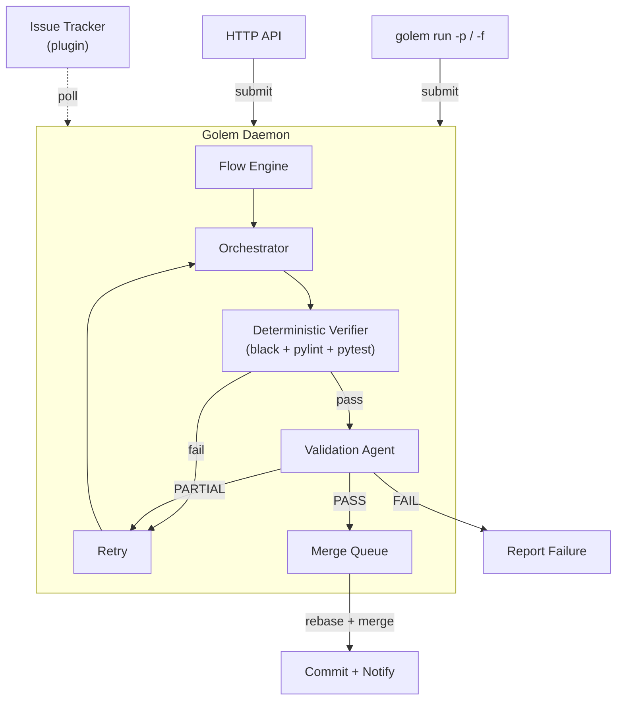
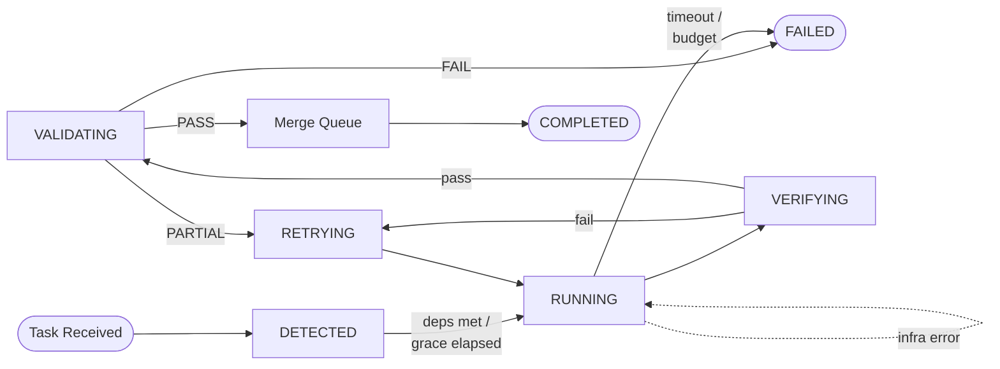
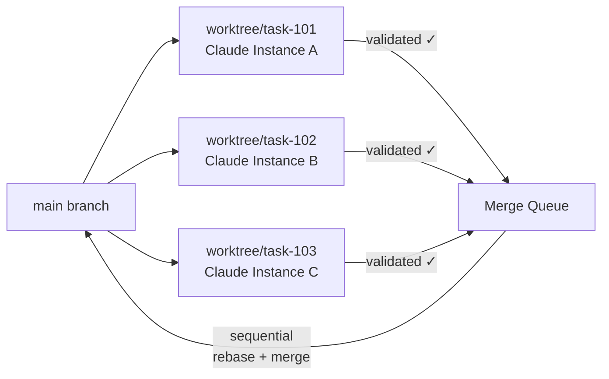
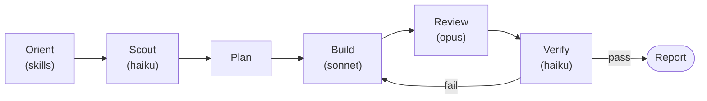
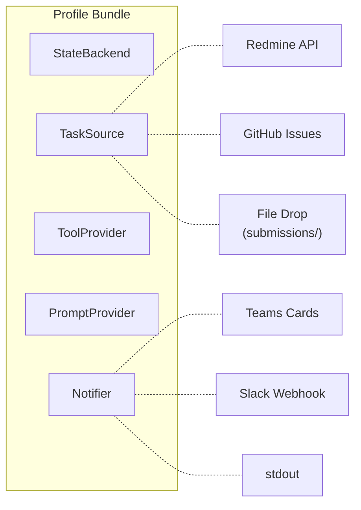

<p align="center">
  
</p>

<h1 align="center">Golem</h1>

<p align="center">
  <strong>An autonomous AI agent that picks up tasks, executes them, and delivers results — no human in the loop.</strong>
</p>

<p align="center">
  <a href="https://www.python.org/downloads/"></a>
  <a href="https://opensource.org/licenses/MIT"></a>
  <a href="#quick-start"></a>
</p>

<p align="center">
  <a href="#quick-start">Quick Start</a>&nbsp;&nbsp;·&nbsp;&nbsp;
  <a href="#why-golem">Why Golem</a>&nbsp;&nbsp;·&nbsp;&nbsp;
  <a href="#how-it-works">How It Works</a>&nbsp;&nbsp;·&nbsp;&nbsp;
  <a href="#agent-intelligence">Agent Intelligence</a>&nbsp;&nbsp;·&nbsp;&nbsp;
  <a href="#configuration">Configuration</a>&nbsp;&nbsp;·&nbsp;&nbsp;
  <a href="#http-api">HTTP API</a>
</p>

---

Golem runs as a daemon, picks up work from your issue tracker or direct prompts, spins up Claude agents, validates the output, commits the results, and notifies your team — in a continuous loop.

Submit a prompt. Walk away. It's done.

---

<!-- TABLE OF CONTENTS -->
<details>
<summary><strong>Table of Contents</strong></summary>

- [Why Golem](#why-golem)
- [Quick Start](#quick-start)
- [How It Works](#how-it-works)
  - [Daemon Architecture](#daemon-centric-architecture)
  - [Task Lifecycle](#task-lifecycle)
  - [Parallel Tasks & Git Worktrees](#parallel-tasks--git-worktrees)
- [Agent Intelligence](#agent-intelligence)
- [Architecture](#architecture)
- [Configuration](#configuration)
- [HTTP API](#http-api)
- [Development](#development)

</details>

---

## Why Golem

Most AI coding tools wait for you to invoke them. Golem runs the other way around.

**Daemon-centric** — Everything runs through the daemon. Submit a prompt from the CLI, drop a file, or hit the HTTP API — the daemon picks it up, executes it in the background, and reports back. If the daemon isn't running, `golem run` starts it automatically.

**Parallel execution** — Multiple Claude instances run simultaneously, each in its own git worktree. Infrastructure failures auto-retry without consuming the task's retry budget. When tasks complete, changes merge cleanly back into your branch.

**Three-layer quality pipeline** — Every task passes through deterministic verification (`black`, `pylint`, `pytest`), then a separate validation agent reviews the work. Failures retry immediately with structured feedback — no LLM review wasted on broken code. Only fully validated work gets committed.

**Skill-driven agents** — Agents discover and invoke relevant skills at each phase of execution — workspace knowledge, test-driven development, debugging workflows, code review criteria, and domain-specific tooling. Skills prevent unfocused exploration and enforce structured workflows.

**Pluggable everything** — The profile system decouples Golem from any specific tracker, notifier, or tool provider. Swap Redmine for GitHub Issues, Teams for Slack, or write your own backend — without touching core logic.

**Batch orchestration** — Submit multiple tasks as a batch with explicit dependency ordering. Task B can declare it depends on Task A — Golem schedules them accordingly and runs post-merge integration validation on the whole group.

**Budget guardrails** — Set per-task dollar limits and timeouts. A one-liner fix won't accidentally burn $50 in API calls.

**Lightweight** — `pip install`, not a Docker image or cloud VM. Golem wraps Claude CLI directly, so you get Claude's full tool-use capabilities without reinventing sandboxing.

---

## Quick Start

### Prerequisites

- **Python 3.11+**
- **[Claude CLI](https://docs.anthropic.com/en/docs/claude-code)** — Golem wraps Claude Code as a subprocess. Install it first and verify `claude --version` works.
- **Git** — for worktree isolation and merge operations.

### 1. Install

```bash
git clone https://github.com/itsmeboris/golem.git && cd golem
pip install -e .
```

### 2. Configure

```bash
cp .env.example .env                   # add your API keys
cp config.yaml.example config.yaml     # tweak settings
```

### 3. Run

```bash
# Submit a prompt — daemon starts automatically if not running
golem run -p "Refactor the logging module to use structured JSON"

# Submit a prompt from a file (great for detailed plans)
golem run -f plan.md

# Run a single task by tracker issue ID
golem run 12345

# Start the daemon in the foreground (for debugging/monitoring)
golem daemon --foreground

# Check what's running — daemon health, active tasks, queue, recent history
golem status

# Launch the web dashboard
golem dashboard --port 8081
```

**`golem status` output:**

```
=== Golem Status (last 24h — golem) ===
  Daemon:       running (PID 48201)

  Uptime:       1h 23m 0s

  ACTIVE:
    # 1001  First-run config wizard (golem init)
           Phase: orchestrating  Model: opus  Elapsed: 4m 12s  Cost: $1.24

  Queue:        0 waiting

  RECENT:
    [OK  ]  2m 0s ago  #  998  Fix login bug                     $0.82  1m 45s
    [FAIL]  18m 0s ago #  997  Add retry logic                   $2.10  5m 30s

  HISTORY:
    Total: 47  Success: 89.4%  Avg: 2m 22s  Cost: $15.82
```

---

## How It Works

### Daemon-Centric Architecture

The daemon is the single execution engine. All task execution flows through it, regardless of how the task was submitted.



### Submitting Tasks

There are four ways to submit work to the daemon:

| Method | How | Best for |
|--------|-----|----------|
| **CLI** | `golem run -p "..."` or `golem run -f plan.md` | Interactive use — auto-starts daemon if needed |
| **HTTP API** | `POST /api/submit {"prompt": "..."}` | Programmatic use, external AI agents |
| **Batch API** | `POST /api/submit/batch {"tasks": [...]}` | Multi-task batches with dependency ordering |
| **File drop** | Write JSON to `data/submissions/` | Batch pipelines, cross-system integration |

The daemon auto-starts when you use `golem run -p` or `golem run -f`. It probes `GET /api/health` to confirm readiness before submitting.

### Task Lifecycle

Each task follows a state machine with automatic transitions:



| State | What happens |
|-------|-------------|
| **DETECTED** | Task received; waits for dependency resolution and grace deadline |
| **RUNNING** | Claude instances execute in isolated worktrees (infra failures auto-retry) |
| **VERIFYING** | Deterministic checks — `black`, `pylint`, `pytest` with 100% coverage. Failure skips the reviewer and retries immediately with structured feedback |
| **VALIDATING** | A separate validation agent reviews the work with verification evidence and shared type contracts |
| **RETRYING** | Partial result — agent retries with validation feedback |
| **COMPLETED** | Validated, merged via merge queue, and team notified |
| **FAILED** | Budget exceeded, timeout hit, or validation failed after retries |

### Parallel Tasks & Git Worktrees

Golem can process multiple tasks at the same time. Each task runs in its own git worktree, a lightweight isolated copy of the repo:



No locks, no conflicts between tasks. Each instance has full read-write access to its own copy. Validated work enters a sequential **merge queue** that rebases onto HEAD and merges in a temporary worktree — the user's working tree is never touched. A post-merge integrity check catches silently dropped additions; a **merge agent** resolves conflicts automatically.

---

## Agent Intelligence

### 5-Phase Workflow

When `supervisor_mode` is enabled (the default), the orchestrator coordinates subagents through five phases:



| Phase | What happens |
|-------|-------------|
| **Orient** | Invoke workspace and domain skills to understand the codebase layout before touching anything. Assess task complexity (trivial / standard / complex). |
| **Scout** | Dispatch fast read-only agents with specific research questions. Returns structured findings with `file:line` references. |
| **Plan** | Using Scout findings, decide what files change, whether subtasks can parallelize, and which skills Builders should use. |
| **Build** | Dispatch code-writing agents with Scout context and skill guidance. Follows TDD when applicable. Independent subtasks run in parallel. |
| **Review** | Adversarial code review by an opus-class agent. Only reports issues with >= 80% confidence. Builders fix flagged issues and re-review. |
| **Verify** | Run `black`, `pylint`, `pytest`. Circuit breaker stops after 3 identical failures. |

### Specialized Subagents

Each subagent role is defined in `.claude/agents/` with a specific model, toolset, and turn limit:

| Agent | Model | Tools | Purpose |
|-------|-------|-------|---------|
| **Scout** | haiku | Read, Grep, Glob | Focused codebase research — answers specific questions fast |
| **Builder** | sonnet | All | Writes code, tests, fixes issues. TDD with `pytest.mark.parametrize` |
| **Reviewer** | opus | Read, Grep, Glob, Bash | Adversarial code review with confidence-based filtering |
| **Verifier** | haiku | Bash | Runs linters and tests, returns structured pass/fail |

### Skill Discovery

Agents have access to **skills** — reusable packages of domain knowledge, structured workflows, and search techniques. Skills are stored in `.claude/skills/` and automatically propagated to child agent sessions.

Every prompt template instructs agents to check for relevant skills before starting work:

- **Workspace skills** — codebase layout, module conventions, verification commands
- **Process skills** — test-driven development, systematic debugging, code review criteria
- **Domain skills** — project-specific tooling, CI/CD integration, MCP server usage

Skills are discovered dynamically via the Skill tool. When new skills are added to `.claude/skills/`, agents pick them up automatically — no prompt changes needed.

---

## Architecture

### Profile System

All external integrations are pluggable via **profiles** — bundles of five backends you can mix and match:



Switch with one line in config:

```yaml
profile: local     # file-based submissions, no external services
profile: redmine   # Redmine issue tracking + Slack/Teams + MCP
profile: github    # GitHub Issues via gh CLI + Slack/Teams
```

| Interface | Purpose | Redmine profile | Local profile | GitHub profile |
|-----------|---------|-----------------|---------------|----------------|
| `TaskSource` | Discover and read tasks | Redmine REST API | File drop (`data/submissions/`) | `gh issue list` |
| `StateBackend` | Update status, post comments | Redmine REST API | No-op | `gh issue edit/comment` |
| `Notifier` | Send lifecycle notifications | Slack or Teams (configurable) | Log to stdout | Slack or Teams (configurable) |
| `ToolProvider` | Select MCP servers per task | Keyword-based scoping | None (or keyword-based if `mcp_enabled`) | None (or keyword-based if `mcp_enabled`) |
| `PromptProvider` | Load prompt templates | `prompts/` directory | `prompts/` | `prompts/` |

The `local` profile is the recommended starting point. Prompts submitted via CLI, HTTP API, or file drop are handled through the daemon regardless of which profile is active.

---

## Configuration

| Setting | Default | Description |
|---------|---------|-------------|
| `profile` | `redmine` | Backend profile (`local`, `redmine`, `github`, or custom) |
| `task_model` | `sonnet` | Claude model for task execution and Builder subagents |
| `orchestrate_model` | `opus` | Model for orchestration and review |
| `supervisor_mode` | `true` | Enable subagent orchestration (Agent tool delegation) |
| `budget_per_task_usd` | `10.0` | Max spend per task (0 = unlimited) |
| `task_timeout_seconds` | `3600` | Timeout per task (0 = unlimited) |
| `max_retries` | `1` | Retries on PARTIAL validation verdict |
| `max_active_sessions` | `3` | Concurrent tasks running in parallel |
| `use_worktrees` | `true` | Isolate tasks in separate git worktrees |
| `auto_commit` | `true` | Git commit on PASS |
| `validation_model` | `opus` | Model for the validation agent |

See [`config.yaml.example`](config.yaml.example) for the full list including budget limits, timeouts, checkpoint intervals, and merge settings.

### Environment Variables

```bash
REDMINE_URL=https://redmine.example.com
REDMINE_API_KEY=your-api-key
TEAMS_GOLEM_WEBHOOK_URL=https://...   # optional, or use Slack:
SLACK_GOLEM_WEBHOOK_URL=https://hooks.slack.com/services/T/B/X  # optional
```

---

<details>
<summary><strong>Custom Profiles</strong></summary>

Three profiles ship built-in: `local`, `redmine`, and `github`. To create your own, implement the five protocols from `interfaces.py` and register:

```python
from golem.profile import register_profile, GolemProfile
from golem.backends.local import LogNotifier, NullToolProvider
from golem.prompts import FilePromptProvider

class JiraTaskSource:
    def poll_tasks(self, projects, detection_tag, timeout=30): ...
    def get_task_description(self, task_id): ...

class JiraStateBackend:
    def update_status(self, task_id, status): ...
    def post_comment(self, task_id, text): ...

def _build_jira_profile(config):
    return GolemProfile(
        name="jira",
        task_source=JiraTaskSource(),
        state_backend=JiraStateBackend(),
        notifier=LogNotifier(),
        tool_provider=NullToolProvider(),
        prompt_provider=FilePromptProvider(),
    )

register_profile("jira", _build_jira_profile)
```

Then set `profile: jira` in `config.yaml`.

</details>

---

## HTTP API

The daemon exposes a REST API (served on the dashboard port, default `8081`).

| Endpoint | Method | Auth | Description |
|----------|--------|------|-------------|
| `/api/health` | GET | None | Readiness probe — returns `{"ok": true, "pid": ..., "uptime_seconds": ...}` |
| `/api/submit` | POST | None | Submit a task — accepts `{"prompt": "..."}` or `{"file": "/path/to/file.md"}` with optional `subject` and `work_dir` |
| `/api/submit/batch` | POST | None | Submit multiple tasks as a batch — accepts `{"tasks": [...], "group_id": "..."}` with per-task `depends_on` for ordering |
| `/api/flow/status` | GET | None | Status of all configured flows |
| `/api/flow/start` | POST | Admin | Start flows by name |
| `/api/flow/stop` | POST | Admin | Stop flows by name |

```bash
curl -X POST http://localhost:8081/api/submit \
  -H "Content-Type: application/json" \
  -d '{"prompt": "Add retry logic to the HTTP client"}'
```

---

## Development

### Prerequisites

```bash
pip install -e ".[dashboard]"
pip install pytest black pylint
```

### Verification

All three must pass before pushing:

```bash
black --check .                             # formatting
pylint --errors-only golem/                 # lint
pytest --cov=golem --cov-fail-under=100     # tests (100% coverage required)
```

A [pre-push hook](.githooks/pre-push) runs all three automatically. Enable it with:

```bash
git config core.hooksPath .githooks
```

---

## License

MIT
