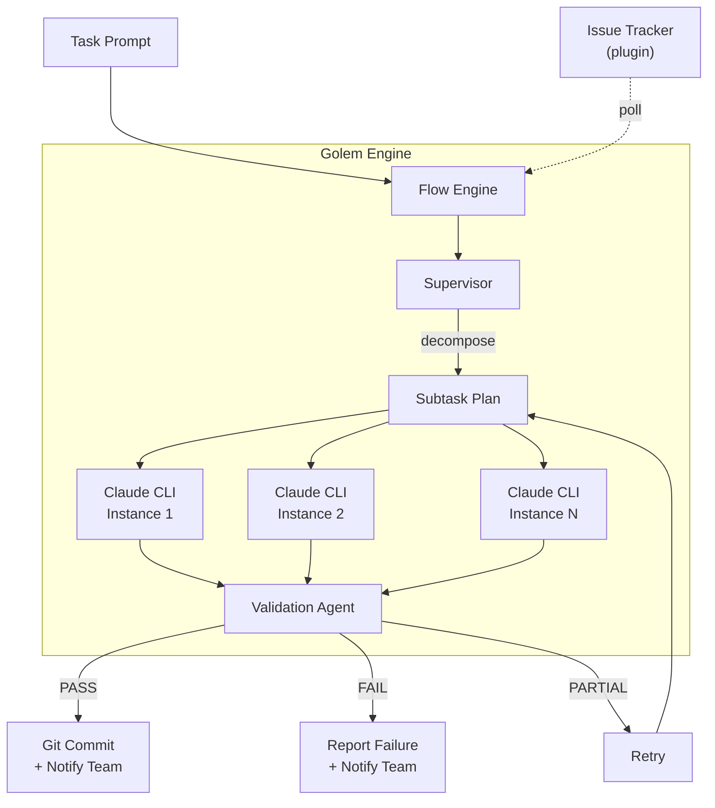
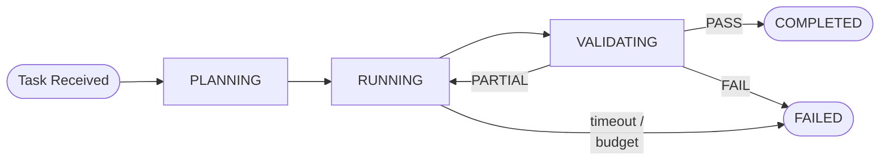
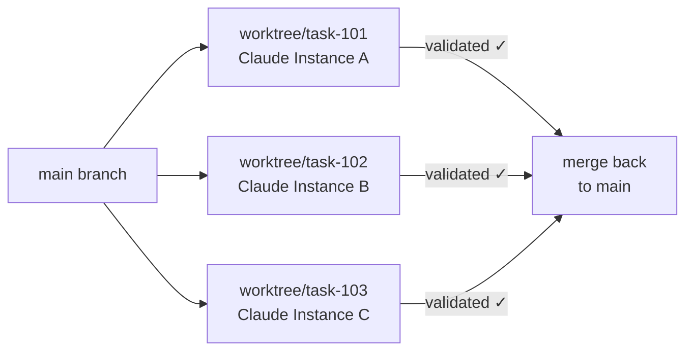
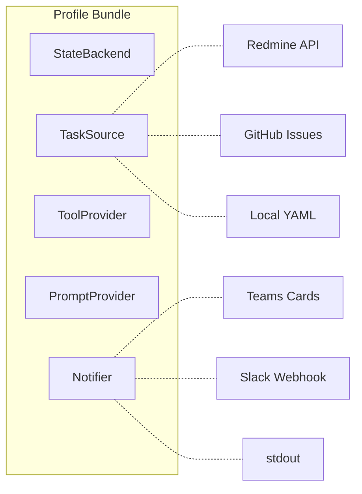

<p align="center">
  
</p>

<h1 align="center">Golem</h1>

<p align="center">
  <strong>An autonomous AI agent that picks up tasks, executes them, and delivers results — no human in the loop.</strong>
</p>

<p align="center">
  <a href="https://www.python.org/downloads/"></a>
  <a href="https://opensource.org/licenses/MIT"></a>
  <a href="#quick-start"></a>
</p>

<p align="center">
  <a href="#quick-start">Quick Start</a>&nbsp;&nbsp;·&nbsp;&nbsp;
  <a href="#why-golem">Why Golem</a>&nbsp;&nbsp;·&nbsp;&nbsp;
  <a href="#how-it-works">How It Works</a>&nbsp;&nbsp;·&nbsp;&nbsp;
  <a href="#configuration">Configuration</a>&nbsp;&nbsp;·&nbsp;&nbsp;
  <a href="#custom-profiles">Custom Profiles</a>
</p>

---

Golem connects to your issue tracker, watches for tagged tasks, spins up Claude agents to solve them, validates the output, commits the results, and notifies your team — in a continuous loop.

Tag an issue. Walk away. It's done.

---

## Why Golem

Most AI coding tools wait for you to invoke them. Golem runs the other way around.

**Fire-and-forget** — Golem runs as a daemon, continuously polling your tracker for tagged issues. No manual invocation, no babysitting. It picks up work on its own, executes, validates, commits, and reports back.

**Parallel execution** — Multiple Claude instances run simultaneously, each on a different task. Every task gets its own git worktree, so concurrent work never collides. When tasks complete, changes merge cleanly back into your branch.

**Closed-loop validation** — Every task goes through a separate validation agent before anything is committed. If the result is partial, Golem retries automatically. Only fully validated work gets committed and pushed.

**Pluggable everything** — The profile system decouples Golem from any specific tracker, notifier, or tool provider. Swap Redmine for GitHub Issues, Teams for Slack, or write your own backend — without touching core logic.

**Budget guardrails** — Set per-task dollar limits and timeouts. A one-liner fix won't accidentally burn $50 in API calls.

**Lightweight** — `pip install`, not a Docker image or cloud VM. Golem wraps Claude CLI directly, so you get Claude's full tool-use capabilities without reinventing sandboxing.

---

## Quick Start

### 1. Install

```bash
git clone https://github.com/itsmeboris/golem.git && cd golem
pip install -e .
```

### 2. Configure

```bash
cp .env.example .env                   # add your API keys
cp config.yaml.example config.yaml     # tweak settings
```

### 3. Run

```bash
# Run a single task by issue ID
golem run 12345

# Run a task from a plain-text prompt (no tracker needed)
golem run -p "Refactor the logging module to use structured JSON"

# Poll for tasks continuously (daemon mode)
golem daemon --foreground

# Launch the web dashboard
golem dashboard --port 8082
```

---

## How It Works

### Execution Pipeline



### Task Lifecycle

Each task follows a state machine with automatic transitions:



| State | What happens |
|-------|-------------|
| **PLANNING** | Supervisor decomposes the task into subtasks |
| **RUNNING** | Claude instances execute subtasks in isolated worktrees |
| **VALIDATING** | A separate validation agent reviews the work |
| **COMPLETED** | Validated, committed, merged, and team notified |
| **FAILED** | Budget exceeded, timeout hit, or validation failed after retries |

### Parallel Tasks & Git Worktrees

Golem can process multiple tasks at the same time. Each task runs in its own git worktree, a lightweight isolated copy of the repo:



No locks, no conflicts between tasks. Each instance has full read-write access to its own copy. Validated work merges back cleanly.

---

## Architecture

### Profile System

All external integrations are pluggable via **profiles** — bundles of five backends you can mix and match:



Switch with one line in config:

```yaml
profile: redmine   # or: local, github, your-custom-profile
```

| Interface | Purpose | Redmine profile | Local profile |
|-----------|---------|-----------------|---------------|
| `TaskSource` | Discover and read tasks | Redmine REST API | YAML files |
| `StateBackend` | Update status, post comments | Redmine REST API | Log to stdout |
| `Notifier` | Send lifecycle notifications | Slack or Teams (configurable) | Log to stdout |
| `ToolProvider` | Select MCP servers per task | Keyword-based scoping | None |
| `PromptProvider` | Load prompt templates | `prompts/` directory | `prompts/` |

<details>
<summary><strong>Project Layout</strong></summary>

```
golem/
├── cli.py                 # CLI entry point
├── flow.py                # Tick-driven poll → detect → orchestrate loop
├── orchestrator.py        # State-machine session lifecycle
├── supervisor.py          # Task decomposition and synthesis
├── validation.py          # Validation agent (PASS/PARTIAL/FAIL)
├── committer.py           # Structured git commits
├── event_tracker.py       # Stream event processing & milestones
├── poller.py              # Task detection from trackers
├── notifications.py       # Teams Adaptive Card builders
├── mcp_scope.py           # Dynamic MCP server selection
├── workdir.py             # Per-task working directory resolution
├── worktree_manager.py    # Git worktree isolation
├── interfaces.py          # Protocol definitions
├── profile.py             # Profile registry
│
├── backends/              # Pluggable backend implementations
│   ├── redmine.py         #   Redmine TaskSource + StateBackend
│   ├── slack_notifier.py  #   Slack Block Kit notifier
│   ├── teams_notifier.py  #   Teams Adaptive Card notifier
│   ├── mcp_tools.py       #   Keyword-based MCP tool provider
│   └── local.py           #   Null/log backends for local dev
│
├── prompts/               # Prompt templates
├── core/                  # Shared utilities
│   ├── cli_wrapper.py     #   Claude CLI subprocess wrapper
│   ├── config.py          #   YAML config with env expansion
│   ├── dashboard.py       #   Web dashboard
│   ├── flow_base.py       #   BaseFlow / PollableFlow
│   └── ...
│
└── tests/                 # Test suite
```

</details>

---

## Configuration

### config.yaml

See [`config.yaml.example`](config.yaml.example) for the full annotated template.

| Setting | Default | Description |
|---------|---------|-------------|
| `profile` | `redmine` | Backend profile (`redmine`, `local`, or custom) |
| `task_model` | `sonnet` | Claude model for execution |
| `budget_per_task_usd` | `10.0` | Max spend per task (0 = unlimited) |
| `supervisor_mode` | `true` | Decompose complex tasks into subtasks |
| `max_retries` | `1` | Retries on PARTIAL validation verdict |
| `auto_commit` | `true` | Git commit on PASS |
| `use_worktrees` | `true` | Isolate tasks in separate git worktrees |
| `max_active_sessions` | `3` | Concurrent tasks running in parallel |

### Environment Variables

```bash
REDMINE_URL=https://redmine.example.com
REDMINE_API_KEY=your-api-key
TEAMS_GOLEM_WEBHOOK_URL=https://...   # optional, or use Slack:
SLACK_GOLEM_WEBHOOK_URL=https://hooks.slack.com/services/T/B/X  # optional
```

---

## Custom Profiles

Implement the five protocols from `interfaces.py` and register:

```python
from golem.profile import register_profile, GolemProfile
from golem.backends.local import LogNotifier, NullToolProvider
from golem.prompts import FilePromptProvider

class GitHubTaskSource:
    def poll_tasks(self, projects, detection_tag, timeout=30):
        ...
    def get_task_description(self, task_id):
        ...

class GitHubStateBackend:
    def update_status(self, task_id, status):
        ...
    def post_comment(self, task_id, text):
        ...

def _build_github_profile(config):
    return GolemProfile(
        name="github",
        task_source=GitHubTaskSource(),
        state_backend=GitHubStateBackend(),
        notifier=LogNotifier(),
        tool_provider=NullToolProvider(),
        prompt_provider=FilePromptProvider(),
    )

register_profile("github", _build_github_profile)
```

Then in `config.yaml`:

```yaml
profile: github
```

---

## Development

```bash
pip install -e ".[dashboard]"
pip install pytest black pylint

pytest golem/tests/ -x -q        # run tests
black golem/                      # format
pylint --errors-only golem/       # lint
```

A [pre-push hook](.githooks/pre-push) runs all three automatically. Enable it with:

```bash
git config core.hooksPath .githooks
```

---

## License

MIT
