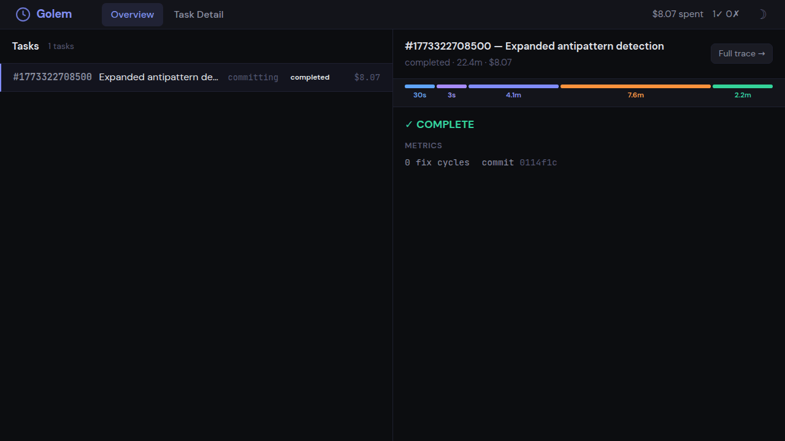
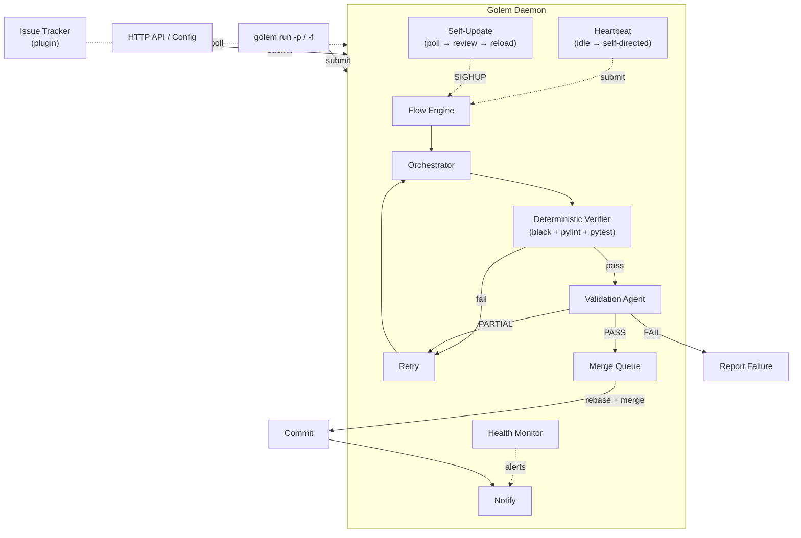
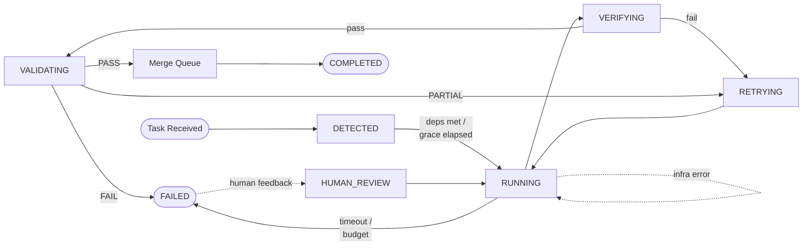
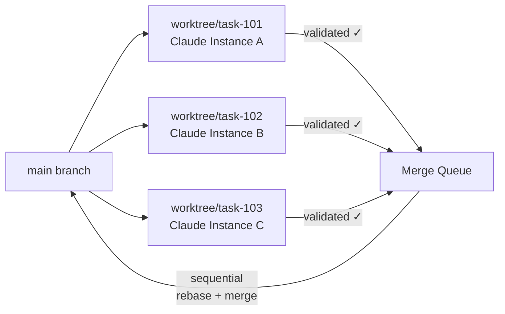
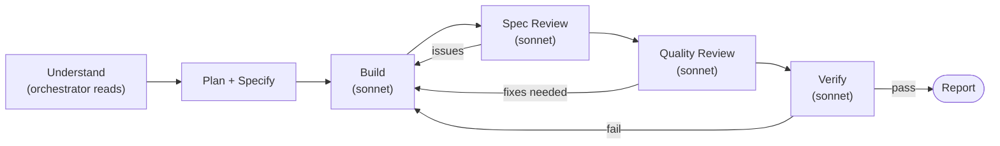
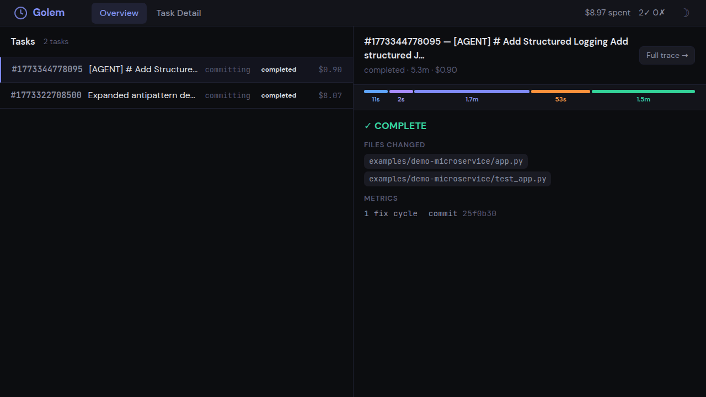
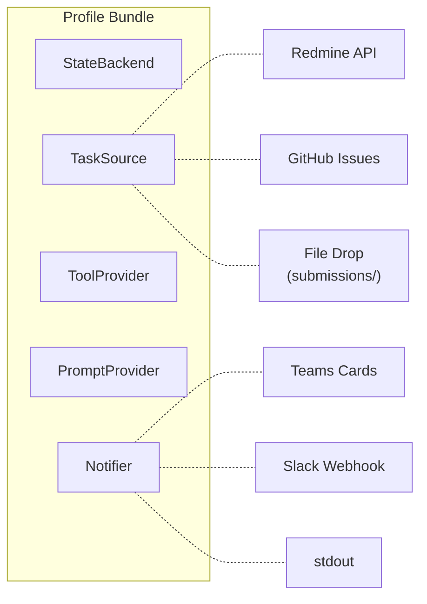

<p align="center">
  
</p>

<h1 align="center">Golem</h1>

<p align="center">
  <strong>An autonomous AI agent that picks up tasks, executes them, and delivers results — no human in the loop.</strong>
</p>

<p align="center">
  
</p>

<p align="center">
  <a href="https://www.python.org/downloads/"></a>
  <a href="https://opensource.org/licenses/MIT"></a>
  <a href="#quick-start"></a>
  <a href="https://star-history.com/#itsmeboris/golem&Date"></a>
  <a href="https://docs.anthropic.com/en/docs/claude-code"></a>
</p>

<p align="center">
  <a href="#quick-start">Quick Start</a>&nbsp;&nbsp;·&nbsp;&nbsp;
  <a href="#why-golem">Why Golem</a>&nbsp;&nbsp;·&nbsp;&nbsp;
  <a href="#how-it-works">How It Works</a>&nbsp;&nbsp;·&nbsp;&nbsp;
  <a href="#agent-intelligence">Agent Intelligence</a>&nbsp;&nbsp;·&nbsp;&nbsp;
  <a href="#heartbeat--self-directed-work">Heartbeat</a>&nbsp;&nbsp;·&nbsp;&nbsp;
  <a href="#configuration">Configuration</a>&nbsp;&nbsp;·&nbsp;&nbsp;
  <a href="docs/operations.md">Operations Guide</a>
</p>

---

Golem runs as a daemon, picks up work from your issue tracker or direct prompts, spins up Claude agents, validates the output, commits the results, and notifies your team — in a continuous loop.

Submit a prompt. Walk away. It's done.

---

<!-- TABLE OF CONTENTS -->
<details>
<summary><strong>Table of Contents</strong></summary>

- [Why Golem](#why-golem)
- [Who Is This For?](#who-is-this-for)
- [How Is This Different?](#how-is-this-different)
- [Quick Start](#quick-start)
- [How It Works](#how-it-works)
  - [Daemon Architecture](#daemon-centric-architecture)
  - [Task Lifecycle](#task-lifecycle)
  - [Parallel Tasks & Git Worktrees](#parallel-tasks--git-worktrees)
- [Agent Intelligence](#agent-intelligence)
- [Heartbeat — Self-Directed Work](#heartbeat--self-directed-work)
- [Self-Update — Zero-Downtime Upgrades](#self-update--zero-downtime-upgrades)
- [Health Monitoring](#health-monitoring)
- [Web Dashboard](#web-dashboard)
- [Architecture](#architecture)
- [Configuration](#configuration)
- [HTTP API](#http-api)
- [Development](#development)

</details>

---

## Why Golem

Most AI coding tools wait for you to invoke them. Golem runs the other way around.

**Daemon-centric** — Everything runs through the daemon. Submit a prompt from the CLI, drop a file, or hit the HTTP API — the daemon picks it up, executes it in the background, and reports back. If the daemon isn't running, `golem run` starts it automatically.

**Parallel execution** — Multiple Claude instances run simultaneously, each in its own git worktree. Infrastructure failures auto-retry without consuming the task's retry budget. When tasks complete, changes merge cleanly back into your branch.

**Deep quality pipeline** — Pre-execution gates catch doomed tasks early: a base branch health check verifies the codebase isn't already broken, and an optional clarity pre-check scores vague requirements before spending budget. Every task then passes through deterministic verification (`black`, `pylint`, `pytest`), AST-based structural analysis, coverage delta on changed files, and a separate validation agent review. Bug-fix tasks are checked for reproduction tests. Known-flaky tests are retried automatically. Failures retry with structured feedback — only fully validated work gets committed.

**Skill-driven agents** — Agents discover and invoke relevant skills at each phase of execution — workspace knowledge, test-driven development, debugging workflows, code review criteria, and domain-specific tooling. Skills prevent unfocused exploration and enforce structured workflows.

**Pluggable everything** — The profile system decouples Golem from any specific tracker, notifier, or tool provider. Swap Redmine for GitHub Issues, Teams for Slack, or write your own backend — without touching core logic.

**Batch orchestration** — Submit multiple tasks as a batch with explicit dependency ordering. Task B can declare it depends on Task A — Golem schedules them accordingly and runs post-merge integration validation on the whole group.

**Heartbeat — self-directed work** — When idle, Golem scans for improvements on its own. It triages untagged issues, finds TODOs in git history, detects low-coverage modules, and submits tasks autonomously — all within a configurable daily budget.

**Self-updating** — The daemon monitors its own repository for upstream changes, reviews diffs with Claude, verifies in a worktree, and hot-reloads via `SIGHUP` — with automatic rollback on crash-loop detection.

**Human feedback loop** — When a task fails and a human posts review comments on the tracker, Golem detects the feedback and re-attempts with the human's guidance as structured input — closing the loop on escalated tasks.

**Budget guardrails** — Set per-task dollar limits and timeouts. A one-liner fix won't accidentally burn $50 in API calls.

**Lightweight** — `pip install`, not a Docker image or cloud VM. Golem wraps Claude CLI directly, so you get Claude's full tool-use capabilities without reinventing sandboxing.

---

## Who Is This For?

**Developers using Claude Code who want it to work autonomously.** If you're already paying for Claude and find yourself running the same "edit → test → fix → commit" loop, Golem automates that entire cycle.

- **Solo developers** — submit a prompt, work on something else, come back to committed code
- **Small teams** — assign tasks to Golem via your issue tracker, get notified when they're done
- **AI/LLM enthusiasts** — a real-world autonomous agent with validation, not a demo or benchmark

## How Is This Different?

Most AI coding tools are interactive — you drive, they assist. Golem is autonomous — you submit, it delivers.

| | Claude Code | Aider | SWE-agent | Devin | **Golem** |
|---|---|---|---|---|---|
| **Mode** | Interactive | Interactive | Autonomous | Autonomous | **Autonomous** |
| **Execution** | Single session | Single session | Single session | Cloud-hosted | **Daemon + parallel worktrees** |
| **Validation** | Manual review | Manual review | Benchmark scoring | Internal | **black + pylint + pytest + AST + review agent** |
| **Budget control** | None | None | None | Subscription | **Per-task dollar limit** |
| **Merge workflow** | Manual | Auto-commit | Patch file | Internal | **Rebase + merge queue + integrity check** |
| **Open source** | No | Yes | Yes | No | **Yes (MIT)** |

Claude Code is the engine. Golem is the autonomous workflow — validation, parallel execution, merge queue, and budget control — that lets you submit a prompt and walk away. Think of it as the CI/CD pipeline around Claude Code.

---

## Quick Start

### Prerequisites

- **Python 3.11+**
- **[Claude CLI](https://docs.anthropic.com/en/docs/claude-code)** — Golem wraps Claude Code as a subprocess. Install it first and verify `claude --version` works.
- **Git** — for worktree isolation and merge operations.

### Cost

Golem requires **Claude CLI** with a paid Anthropic plan (Claude Pro or API access). Typical task costs:

| Task type | Typical cost | Typical time |
|-----------|-------------|-------------|
| Simple bug fix | $0.50–$1.00 | 1–3 min |
| New feature / endpoint | $1.00–$3.00 | 2–5 min |
| Complex refactor | $3.00–$8.00 | 5–15 min |

The `budget_per_task_usd` setting (default: $10) caps spend per task. A one-liner fix won't accidentally burn $50.

### 1. Install

```bash
git clone https://github.com/itsmeboris/golem.git && cd golem
pip install -e .
```

### 2. Configure

```bash
golem init                             # interactive wizard
# or manually:
cp config.yaml.example config.yaml     # tweak settings
```

<details>
<summary><strong>GitHub Issues setup</strong></summary>

To have Golem poll GitHub Issues instead of local file drops:

```bash
gh auth login                          # authenticate the gh CLI
golem init                             # select "github" profile, enter owner/repo
```

Or set it manually in `config.yaml`:

```yaml
profile: github
projects:
  - owner/repo
detection_tag: golem                   # label on issues Golem should pick up
```

Golem assigns issues to itself on pickup, closes them on completion, and creates a PR for each committed task.

</details>

### 3. Run

```bash
# Submit a prompt — daemon starts automatically if not running
golem run -p "Refactor the logging module to use structured JSON"

# Submit a prompt from a file (great for detailed plans)
golem run -f plan.md

# Run a single task by tracker issue ID
golem run 12345

# Start the daemon in the foreground (for debugging/monitoring)
golem daemon --foreground

# Check what's running — daemon health, active tasks, queue, recent history
golem status

# Launch the web dashboard
golem dashboard --port 8081

# Edit config interactively (TUI)
golem config

# Get/set individual config values
golem config get heartbeat_enabled
golem config set heartbeat_enabled true    # sends SIGHUP to reload

# Hot-reload the daemon without restart
kill -HUP $(cat data/golem.pid)
```

**`golem status` output:**

```
=== Golem Status (last 24h — golem) ===
  Daemon:       running (PID 48201)

  Uptime:       1h 23m 0s

  ACTIVE:
    # 1001  First-run config wizard (golem init)
           Phase: orchestrating  Model: opus  Elapsed: 4m 12s  Cost: $1.24

  Queue:        0 waiting

  RECENT:
    [OK  ]  2m 0s ago  #  998  Fix login bug                     $0.82  1m 45s
    [FAIL]  18m 0s ago #  997  Add retry logic                   $2.10  5m 30s

  HISTORY:
    Total: 47  Success: 89.4%  Avg: 2m 22s  Cost: $15.82
```

---

## How It Works

### Daemon-Centric Architecture

The daemon is the single execution engine. All task execution flows through it, regardless of how the task was submitted.



### Submitting Tasks

There are four ways to submit work to the daemon:

| Method | How | Best for |
|--------|-----|----------|
| **CLI** | `golem run -p "..."` or `golem run -f plan.md` | Interactive use — auto-starts daemon if needed |
| **HTTP API** | `POST /api/submit {"prompt": "..."}` | Programmatic use, external AI agents |
| **Batch API** | `POST /api/submit/batch {"tasks": [...]}` | Multi-task batches with dependency ordering |
| **File drop** | Write JSON to `data/submissions/` | Batch pipelines, cross-system integration |

The daemon auto-starts when you use `golem run -p` or `golem run -f`. It probes `GET /api/health` to confirm readiness before submitting.

### Task Lifecycle

Each task follows a state machine with automatic transitions:



| State | What happens |
|-------|-------------|
| **DETECTED** | Task received; waits for dependency resolution and grace deadline |
| **RUNNING** | Claude instances execute in isolated worktrees (infra failures auto-retry) |
| **VERIFYING** | Deterministic checks — `black`, `pylint`, `pytest` with 100% coverage, plus AST analysis and coverage delta on changed files. Failure skips the reviewer and retries immediately with structured feedback |
| **VALIDATING** | A separate validation agent reviews the work with verification evidence, spec fidelity checks, and reproduction test detection for bug fixes |
| **RETRYING** | Partial result — agent retries with validation feedback |
| **COMPLETED** | Validated, merged via merge queue, and team notified |
| **FAILED** | Budget exceeded, timeout hit, or validation failed after retries |
| **HUMAN_REVIEW** | Human posted feedback on a failed task — agent re-attempts with the human's guidance |

### Parallel Tasks & Git Worktrees

Golem can process multiple tasks at the same time. Each task runs in its own git worktree, a lightweight isolated copy of the repo:



No locks, no conflicts between tasks. Each instance has full read-write access to its own copy. Validated work enters a sequential **merge queue** that rebases onto HEAD and merges in a temporary worktree — the user's working tree is never touched. A post-merge integrity check catches silently dropped additions; a **merge agent** resolves conflicts automatically.

---

## Agent Intelligence

### 5-Phase Workflow

When `supervisor_mode` is enabled (the default), the orchestrator coordinates subagents through five phases:



| Phase | What happens |
|-------|-------------|
| **Understand** | Orchestrator reads 3-5 key files directly (no Scout needed for most tasks). Invokes workspace skills, assesses complexity (trivial / standard / complex). Writes `## Phase: UNDERSTAND` marker. |
| **Plan + Specify** | Using its own findings, decides what files change, whether subtasks can parallelize. Writes 3-7 **specification statements** (SPEC-1, SPEC-2, ...) — these are verified by Builders and Reviewers. Writes `## Phase: PLAN` marker. |
| **Build** | Dispatch Builders with exploration context, spec statements, and prior builder output (**context chaining** — each builder's summary feeds the next). Builders self-verify with targeted `pytest -x` + `black --check`. Bug-fix tasks require a reproduction test first. Writes `## Phase: BUILD` marker. |
| **Spec Review** | Verifies implementation matches each SPEC statement. Reads actual code — does not trust Builder self-reports. Issues trigger a fix-and-re-review cycle. |
| **Quality Review** | Only after Spec Review passes. Checks code quality, bugs, edge cases, naming. Reports issues with >= 80% confidence. Writes `## Phase: REVIEW` marker. |
| **Verify** | Full-suite `black`, `pylint`, `pytest --cov` — the only full run in the workflow. Circuit breaker stops after repeated identical failures. Writes `## Phase: VERIFY` marker. |

### Specialized Subagents

Each subagent role is defined in `.claude/agents/` with a specific model, toolset, and turn limit:

| Agent | Model | Tools | Purpose |
|-------|-------|-------|---------|
| **Builder** | sonnet | All | Writes code, tests, fixes issues. Self-verifies with targeted tests before reporting |
| **Spec Reviewer** | sonnet | Read, Grep, Glob | Verifies implementation matches specification — does not trust Builder reports |
| **Quality Reviewer** | sonnet | Read, Grep, Glob | Code quality, bugs, edge cases. Only reports issues with >= 80% confidence |
| **Verifier** | sonnet | Bash | Runs full-suite linters and tests, returns structured pass/fail |
| **Scout** | haiku | Read, Grep, Glob | Reserved for unknown codebases — most tasks don't need one |

### Skill Discovery

Agents have access to **skills** — reusable packages of domain knowledge, structured workflows, and search techniques. Skills are stored in `.claude/skills/` and automatically propagated to child agent sessions.

Every prompt template instructs agents to check for relevant skills before starting work:

- **Workspace skills** — codebase layout, module conventions, verification commands
- **Process skills** — test-driven development, systematic debugging, code review criteria
- **Domain skills** — project-specific tooling, CI/CD integration, MCP server usage

Skills are discovered dynamically via the Skill tool. When new skills are added to `.claude/skills/`, agents pick them up automatically — no prompt changes needed.

---

## Heartbeat — Self-Directed Work

When idle for 15 minutes (configurable), Golem discovers work on its own via a two-tier system:

- **Tier 1 — Issue triage:** scans untagged issues, triages with Haiku for automatability and complexity
- **Tier 2 — Self-improvement:** finds TODOs in git history, low-coverage modules, and recurring antipatterns

Candidates are deduplicated and submitted through the normal agent pipeline — same validation, budget controls, and merge queue. Daily spend is capped (`heartbeat_daily_budget_usd`, default $1).

```yaml
heartbeat_enabled: true
heartbeat_idle_threshold_seconds: 900   # 15 min idle before activation
heartbeat_daily_budget_usd: 1.0         # daily spend cap
```

See [docs/operations.md](docs/operations.md#heartbeat--self-directed-work) for the full config reference.

---

## Self-Update — Zero-Downtime Upgrades

The daemon monitors its own Git repository for upstream changes: polls the remote, reviews diffs with Claude (ACCEPT/REJECT), verifies in a worktree, and applies on `SIGHUP` — with automatic rollback if the daemon crash-loops after an update.

```yaml
self_update_enabled: true
self_update_branch: master
self_update_strategy: merged_only       # or "any_commit"
```

**SIGHUP reload:** `golem config set` sends `SIGHUP` automatically. The daemon drains active sessions, applies any staged update, and restarts via `os.execv`. Manual: `kill -HUP $(cat data/golem.pid)`.

See [docs/operations.md](docs/operations.md#self-update--zero-downtime-upgrades) for the full pipeline and config.

---

## Health Monitoring

Real-time health tracking with threshold-based alerts for consecutive failures, error rate, queue depth, daemon inactivity, and disk usage. Status tiers: **healthy** → **degraded** → **unhealthy**. Alerts fire through the configured notifier (Slack, Teams, or stdout) with a 15-minute cooldown.

```yaml
health:
  enabled: true
  consecutive_failure_threshold: 3
  error_rate_threshold: 0.5
```

See [docs/operations.md](docs/operations.md#health-monitoring) for all thresholds and metrics.

---

## Web Dashboard

Launch with `golem dashboard --port 8081`. The dashboard is served alongside the REST API on the same port.

<p align="center">
  
</p>

| View | What it shows |
|------|--------------|
| **Overview** | Task list with status, cost, and elapsed time on the left; a preview panel on the right. Includes a status color legend for merge queue states |
| **Task Detail** | Header with task metadata, a metrics strip, a phase-aware timeline with sidebar navigation for each phase (UNDERSTAND / PLAN / BUILD / REVIEW / VERIFY), and a live strip showing current phase and elapsed time while the task is running |
| **Merge Queue** | Real-time view of the merge pipeline — metrics bar (pending / merging / deferred / conflicts / merged today / failed today), collapsible sections for Active, Pending, Deferred, Conflicts, and Recent merges, expandable entry details, and one-click retry for failed or deferred entries |
| **Config** | Live config editor organized by category (profile, budget, models, heartbeat, self-update, health, etc.) with field metadata, validation, and optional daemon reload on save |

Additional features:

- **JSONL trace parsing** — raw agent traces are parsed into structured timelines with phase detection, subagent grouping, and per-tool usage visualization
- **Polling with cache bypass** — the timeline endpoint accepts `?since_event=N`; when the trace hasn't grown since the last poll the server returns the cached result, avoiding a full re-parse
- **Dark / light theme** — toggle in the header; preference persists via localStorage

---

## Architecture

### Profile System

All external integrations are pluggable via **profiles** — bundles of five backends you can mix and match:



Switch with one line in config:

```yaml
profile: local     # file-based submissions, no external services
profile: redmine   # Redmine issue tracking + Slack/Teams + MCP
profile: github    # GitHub Issues via gh CLI + Slack/Teams
```

| Interface | Purpose | Redmine profile | Local profile | GitHub profile |
|-----------|---------|-----------------|---------------|----------------|
| `TaskSource` | Discover and read tasks | Redmine REST API | File drop (`data/submissions/`) | `gh issue list` |
| `StateBackend` | Update status, post comments | Redmine REST API | No-op | `gh issue edit/comment` |
| `Notifier` | Send lifecycle notifications | Slack or Teams (configurable) | Log to stdout | Slack or Teams (configurable) |
| `ToolProvider` | Select MCP servers per task | Keyword-based scoping | None (or keyword-based if `mcp_enabled`) | None (or keyword-based if `mcp_enabled`) |
| `PromptProvider` | Load prompt templates | `prompts/` directory | `prompts/` | `prompts/` |

The `local` profile is the recommended starting point. Prompts submitted via CLI, HTTP API, or file drop are handled through the daemon regardless of which profile is active.

---

## Configuration

| Setting | Default | Description |
|---------|---------|-------------|
| `profile` | `redmine` | Backend profile (`local`, `redmine`, `github`, or custom) |
| `task_model` | `sonnet` | Claude model for task execution and Builder subagents |
| `orchestrate_model` | `opus` | Model for orchestration and review |
| `supervisor_mode` | `true` | Enable subagent orchestration (Agent tool delegation) |
| `budget_per_task_usd` | `10.0` | Max spend per task (0 = unlimited) |
| `task_timeout_seconds` | `3600` | Timeout per task (0 = unlimited) |
| `max_retries` | `1` | Retries on PARTIAL validation verdict |
| `max_active_sessions` | `3` | Concurrent tasks running in parallel |
| `use_worktrees` | `true` | Isolate tasks in separate git worktrees |
| `auto_commit` | `true` | Git commit on PASS |
| `validation_model` | `opus` | Model for the validation agent |
| `preflight_verify` | `true` | Run verifier on base branch before agent starts — catches broken codebases early; falls back to last verified commit if HEAD is broken |
| `ast_analysis` | `true` | Run ast-grep structural rules during validation (requires `sg` binary) |
| `clarity_check` | `false` | Opt-in: score task clarity with haiku before execution |
| `clarity_threshold` | `3` | Minimum clarity score (1–5) to proceed without human clarification |
| `context_injection` | `true` | Auto-inject AGENTS.md + CLAUDE.md from workspace into agent sessions as system prompt context |
| `ensemble_on_second_retry` | `false` | Spawn parallel candidates with different strategies on second retry |
| `ensemble_candidates` | `2` | Number of parallel candidates for ensemble retry |
| `flaky_tests_file` | `""` | Path to known-flaky tests JSON registry; empty = disabled |
| `heartbeat_enabled` | `false` | Enable self-directed work when idle (see [Heartbeat](#heartbeat--self-directed-work)) |
| `heartbeat_daily_budget_usd` | `1.0` | Daily spend cap for heartbeat-spawned tasks |
| `self_update_enabled` | `false` | Monitor own repo for upstream changes (see [Self-Update](#self-update--zero-downtime-upgrades)) |
| `self_update_branch` | `master` | Remote branch to watch for updates |
| `health.enabled` | `true` | Enable health monitoring with threshold-based alerts |
| `daemon.drain_timeout_seconds` | `300` | Grace period for active sessions during SIGHUP reload |

See [`config.yaml.example`](config.yaml.example) for the full list including budget limits, timeouts, checkpoint intervals, and merge settings.

### Config Management

```bash
golem config                        # interactive TUI editor
golem config get <field>            # read a single value
golem config set <field> <value>    # update a value + trigger daemon reload
golem config list                   # list all fields (sensitive values masked)
```

Changes made via `golem config set` are written atomically and the daemon is sent `SIGHUP` to pick them up without restart.

### Environment Variables

```bash
REDMINE_URL=https://redmine.example.com
REDMINE_API_KEY=your-api-key
TEAMS_GOLEM_WEBHOOK_URL=https://...   # optional, or use Slack:
SLACK_GOLEM_WEBHOOK_URL=https://hooks.slack.com/services/T/B/X  # optional
```

---

<details>
<summary><strong>Custom Profiles</strong></summary>

Three profiles ship built-in: `local`, `redmine`, and `github`. To create your own, implement the five protocols from `interfaces.py` and register:

```python
from golem.profile import register_profile, GolemProfile
from golem.backends.local import LogNotifier, NullToolProvider
from golem.prompts import FilePromptProvider

class JiraTaskSource:
    def poll_tasks(self, projects, detection_tag, timeout=30): ...
    def get_task_description(self, task_id): ...

class JiraStateBackend:
    def update_status(self, task_id, status): ...
    def post_comment(self, task_id, text): ...

def _build_jira_profile(config):
    return GolemProfile(
        name="jira",
        task_source=JiraTaskSource(),
        state_backend=JiraStateBackend(),
        notifier=LogNotifier(),
        tool_provider=NullToolProvider(),
        prompt_provider=FilePromptProvider(),
    )

register_profile("jira", _build_jira_profile)
```

Then set `profile: jira` in `config.yaml`.

</details>

---

## HTTP API

The daemon exposes a REST API (served on the dashboard port, default `8081`).

| Endpoint | Method | Auth | Description |
|----------|--------|------|-------------|
| `/api/health` | GET | None | Readiness probe — returns `{"ok": true, "pid": ..., "uptime_seconds": ...}` |
| `/api/submit` | POST | None | Submit a task — accepts `{"prompt": "..."}` or `{"file": "/path/to/file.md"}` with optional `subject` and `work_dir` |
| `/api/submit/batch` | POST | None | Submit multiple tasks as a batch — accepts `{"tasks": [...], "group_id": "..."}` with per-task `depends_on` for ordering |
| `/api/flow/status` | GET | None | Status of all configured flows |
| `/api/flow/start` | POST | Admin | Start flows by name |
| `/api/flow/stop` | POST | Admin | Stop flows by name |
| `/api/analytics` | GET | None | Quality metrics — pass/fail rates, avg cost, retry effectiveness, top failure reasons |
| `/api/live` | GET | None | Live dashboard state — active tasks, queue depth, uptime, and recently completed tasks |
| `/api/cost-analytics` | GET | None | Cost analytics and budget insights — spend per task, totals, budget remaining |
| `/api/cancel/{task_id}` | POST | None | Cancel a running task |
| `/api/sessions` | GET | None | All session metadata |
| `/api/sessions/{task_id}` | GET | None | Session details for a specific task |
| `/api/batch/{group_id}` | GET | None | Status of a submitted batch by group ID |
| `/api/batches` | GET | None | List all known batches |
| `/api/merge-queue` | GET | None | Merge queue snapshot — pending, active, deferred, conflicts, and recent history |
| `/api/merge-queue/retry/{session_id}` | POST | None | Re-enqueue a failed or deferred merge entry |
| `/api/config` | GET | Admin* | Current config grouped by category with field metadata |
| `/api/config/update` | POST | Admin* | Validate and apply config updates; triggers daemon reload |
| `/api/self-update` | GET | None | Self-update status — branch, last check, verdict, history |
| `/api/logs` | GET | None | Tail of the daemon log file |
| `/api/trace-parsed/{event_id}` | GET | None | Structured trace with phase detection, subagent grouping, and tool timelines; accepts `?since_event=N` to skip re-parsing when unchanged |
| `/api/trace/{event_id}` | GET | None | Raw JSONL trace parsed into sections |
| `/api/trace-terminal/{event_id}` | GET | None | Terminal-renderable event list |
| `/api/prompt/{event_id}` | GET | None | Prompt text for a task |
| `/api/report/{event_id}` | GET | None | Report markdown for a completed task |

*Admin\* = requires `admin_token` header if configured; open access otherwise.*

```bash
curl -X POST http://localhost:8081/api/submit \
  -H "Content-Type: application/json" \
  -d '{"prompt": "Add retry logic to the HTTP client"}'
```

---

## Development

### Prerequisites

```bash
pip install -e ".[dashboard]"
pip install pytest black pylint
```

### Verification

All three must pass before pushing:

```bash
black --check .                             # formatting
pylint --errors-only golem/                 # lint
pytest --cov=golem --cov-fail-under=100     # tests (100% coverage required)
```

A [pre-push hook](.githooks/pre-push) runs all three automatically. Set up with:

```bash
make setup        # or: git config core.hooksPath .githooks
```

This is also done automatically by `golem init`.

---

## License

MIT
