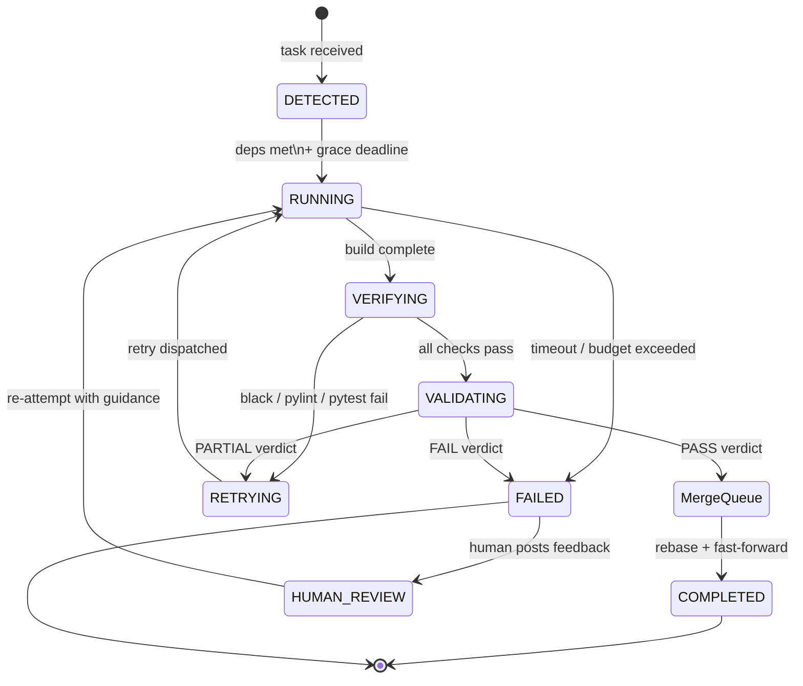
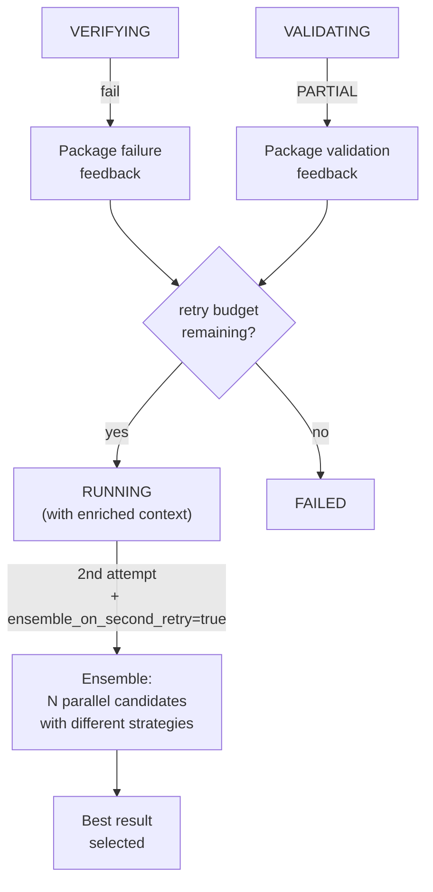
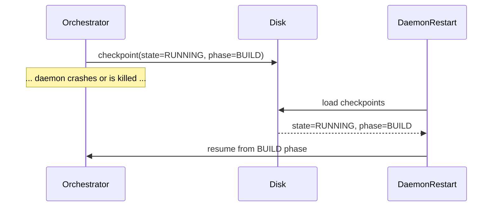

# Task Lifecycle

Every task processed by Golem follows a deterministic state machine with
automatic transitions. No manual state manipulation is needed — the Orchestrator
advances states based on outcomes, persists checkpoints on every tick, and
recovers cleanly after daemon restarts.

See also: [[Architecture]] for the system overview, [[Sub-Agents]] for what
happens during RUNNING.

---

## Overview

A task moves from DETECTED through RUNNING, VERIFYING, VALIDATING, and finally
into COMPLETED (or FAILED). Infrastructure failures during RUNNING do not
consume retry budget — they trigger an automatic re-attempt within the same
state. Only validation-level failures (PARTIAL verdict) count against
`max_retries`.

---

## State Diagram



---

## State Reference

| State | Triggered by | What happens | Exits when |
|-------|-------------|--------------|-----------|
| **DETECTED** | Task submitted via any method | Waits for dependency resolution and grace deadline. Dependency-ordered batches stay here until `depends_on` tasks reach COMPLETED. | All deps met; grace deadline passed |
| **RUNNING** | Deps met; or RETRYING dispatches a new attempt | Orchestrator coordinates subagents through 5 phases (UNDERSTAND → PLAN → BUILD → REVIEW → VERIFY) in an isolated git worktree. Infrastructure failures (network timeouts, subprocess crashes) auto-retry without consuming the retry budget. | BUILD phase complete; or timeout/budget hit |
| **VERIFYING** | RUNNING phase complete | Deterministic checks run: `black` (formatting), `pylint --errors-only` (lint), `pytest --cov` (tests + 100% coverage). Also runs AST analysis on changed files and checks coverage delta. | All checks pass (→ VALIDATING) or any check fails (→ RETRYING) |
| **VALIDATING** | VERIFYING passes | A separate Claude Validation Agent session reviews the work: spec fidelity checks against SPEC statements, reproduction test detection for bug fixes, documentation relevance checks for user-facing changes, and overall evidence quality. | PASS (→ Merge Queue), PARTIAL (→ RETRYING), or FAIL (→ FAILED) |
| **RETRYING** | VERIFYING fail or VALIDATING PARTIAL | Packages verification failure details or validation feedback into structured context. Decrements the retry budget. | Immediately → RUNNING with enriched feedback |
| **COMPLETED** | Merge Queue succeeds | Work rebased onto HEAD and fast-forwarded into main. Configured Notifier fires a completion event. Pitfall extraction and learning loop run asynchronously. | Terminal state |
| **FAILED** | Budget exceeded, timeout, or FAIL verdict after retries | Task recorded as failed. Report generated. Notifier fires. No further automatic action. | Human feedback received (→ HUMAN_REVIEW) |
| **HUMAN_REVIEW** | Human posts feedback on a failed task | Task re-queued with the human's guidance appended to the original prompt as additional context. | Immediately → RUNNING |

---

## Submission Methods

| Method | How | Best use case |
|--------|-----|---------------|
| **CLI** | `golem run -p "prompt"` or `golem run -f plan.md` | Interactive use — auto-starts daemon if not running; probes `/api/health` before submitting |
| **HTTP API** | `POST /api/submit {"prompt": "..."}` | Programmatic use, external AI agents, CI/CD pipelines |
| **Batch API** | `POST /api/submit/batch {"tasks": [...]}` | Multi-task batches; each task can declare `depends_on` for ordering constraints — dependent tasks stay in DETECTED until prerequisites reach COMPLETED |
| **File drop** | Write JSON to `data/submissions/` | Batch pipelines, cross-system integration, offline queuing |

```bash
# CLI — most common for interactive use
golem run -p "Add retry logic to the HTTP client"

# HTTP API
curl -X POST http://localhost:8081/api/submit \
  -H "Content-Type: application/json" \
  -d '{"prompt": "Add retry logic to the HTTP client"}'

# Batch with dependency ordering
curl -X POST http://localhost:8081/api/submit/batch \
  -H "Content-Type: application/json" \
  -d '{
    "tasks": [
      {"prompt": "Add the base HTTP client", "task_id": "t1"},
      {"prompt": "Add retry logic", "depends_on": ["t1"]}
    ],
    "group_id": "http-client-work"
  }'
```

---

## Retry Logic



Key behaviors:

- **Retry budget** — controlled by `max_retries` (default: 1). Each PARTIAL
  validation verdict consumes one retry.
- **Infrastructure failures** — network timeouts, subprocess crashes, and
  similar transient failures during RUNNING automatically re-attempt within the
  same state and do **not** consume the retry budget.
- **Verification failures** — fed back as structured context (which checks
  failed, exact error output) before the next RUNNING attempt.
- **Ensemble strategy** — when `ensemble_on_second_retry: true`, the second
  attempt spawns `ensemble_candidates` (default: 2) parallel builder candidates
  with different strategies. The best result is selected. Implemented in
  `golem/ensemble.py`.
- **Clarity pre-check** — when `clarity_check: true`, Golem scores task
  clarity with Haiku before execution. Tasks below `clarity_threshold` (1–5
  scale, default: 3) are flagged for human clarification before consuming
  budget.

---

## Checkpoint and Recovery

The Orchestrator checkpoints full session state on every tick to
`data/sessions/<task_id>.json`.



What is persisted per checkpoint:

- Current state (DETECTED, RUNNING, VERIFYING, etc.)
- Active phase within RUNNING (UNDERSTAND, PLAN, BUILD, REVIEW, VERIFY)
- Retry count remaining
- Accumulated context from completed phases (files read, spec statements,
  builder summaries)
- Worktree path and git SHA
- Cost and token usage so far

**Stale checkpoint detection** — on startup, Golem inspects checkpoint
timestamps. Sessions that were RUNNING at crash time are re-queued from the
beginning of the BUILD phase (context from UNDERSTAND and PLAN is preserved).
Sessions that were in VERIFYING or later are re-run from VERIFYING — the
worktree changes are intact.

**Recovery on daemon restart:**

```bash
# Daemon auto-recovers in-progress tasks on startup
python -m golem

# Check status of a recovered task
golem status <task_id>
```

The checkpoint interval is controlled by the tick loop frequency (default:
every few seconds). There is no explicit `checkpoint_interval` setting — the
Orchestrator checkpoints after every meaningful state transition.

**Checkpoint corruption resilience** — if a checkpoint file contains invalid
JSON on load, the bad file is renamed to `checkpoint.json.corrupt` (preserving
it for forensic recovery) and the error is logged at ERROR level. The session
resumes as if no checkpoint existed.

---

## Retry Signal Promotion

The Orchestrator accumulates `ObservationSignal` objects from verification
output across retries. When a signal's frequency crosses a threshold it is
promoted and appended to `TaskSession.promoted_signals`. On the last retry,
if any promoted signals are present, the session escalates immediately with
the signal descriptions included in the failure report, giving humans a
clear description of the systematic issue.

---

## Human Feedback Guard

When a human posts feedback on a FAILED task, two guards prevent infinite
loops:

- **Identical feedback** — if the new comment is identical (case-insensitive,
  stripped) to `previous_feedback`, the retry counter is not reset. The
  session still re-attempts but the budget is not refreshed.
- **Retry cap** — if `retry_count >= max_retries`, the feedback is recorded
  but no new attempt is spawned. The session stays FAILED.
