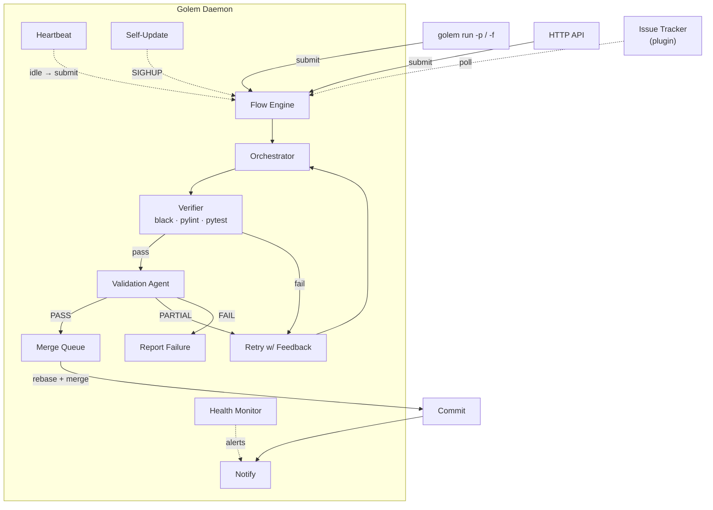
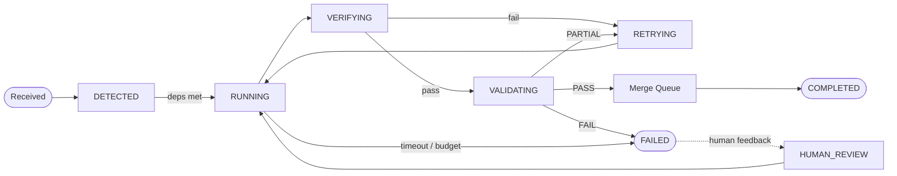
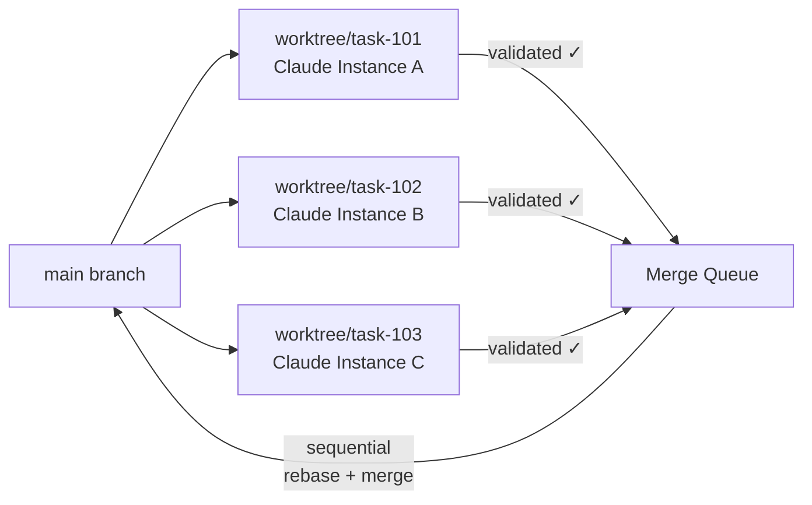
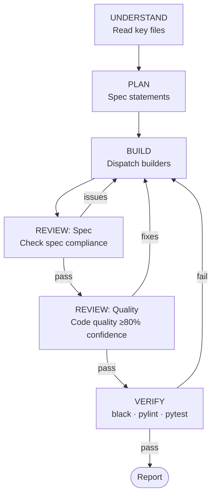
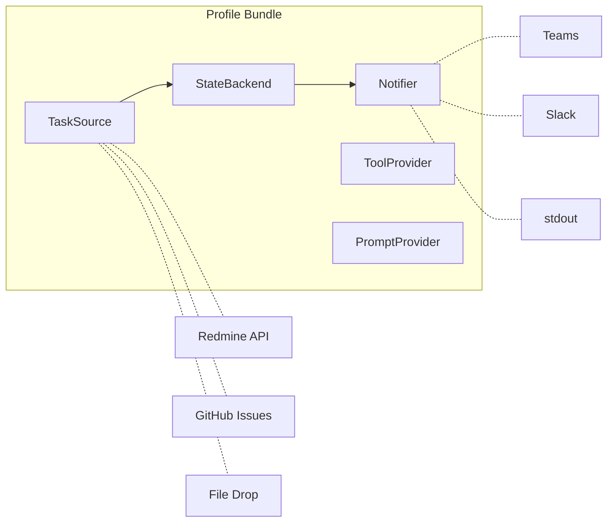

# Architecture

> **See also:** The [Architecture wiki page](https://github.com/itsmeboris/Golem/wiki/Architecture) for the latest version with interactive Mermaid diagrams, plus deep-dive pages on [Task Lifecycle](https://github.com/itsmeboris/Golem/wiki/Task-Lifecycle), [Sub-Agents](https://github.com/itsmeboris/Golem/wiki/Sub-Agents), and [Backends](https://github.com/itsmeboris/Golem/wiki/Backends).

## Golem Technical Deep Dive

This document is the comprehensive technical reference for Golem's internals — runtime pipeline, task lifecycle, agent system, profile model, and HTTP API. For installation and quick start, see the [README](../README.md). For configuration, operations, and deployment, see [docs/operations.md](operations.md).

---

## Daemon Architecture

The daemon is the single execution engine. All task execution flows through it regardless of how the task was submitted — CLI prompts, HTTP API calls, and issue tracker polls all converge on the same internal pipeline.



The **Flow Engine** (`golem/flow.py`) handles Claude CLI invocation and event-stream parsing. The **Orchestrator** (`golem/orchestrator.py`) is a durable state machine that checkpoints on every tick so in-progress tasks survive daemon restarts. The **Verifier** (`golem/verifier.py`) runs deterministic checks. The **Validation Agent** (`golem/validation.py`) dispatches a separate Claude session that reviews evidence and returns a structured verdict.

---

## Submitting Tasks

There are four ways to submit work to the daemon:

| Method | How | Best for |
|--------|-----|----------|
| **CLI** | `golem run -p "..."` or `golem run -f plan.md` | Interactive use — auto-starts daemon if needed |
| **HTTP API** | `POST /api/submit {"prompt": "..."}` | Programmatic use, external AI agents |
| **Batch API** | `POST /api/submit/batch {"tasks": [...]}` | Multi-task batches with dependency ordering |
| **File drop** | Write JSON to `data/submissions/` | Batch pipelines, cross-system integration |

The daemon auto-starts when you use `golem run -p` or `golem run -f`. It probes `GET /api/health` to confirm readiness before submitting. When using batch submission, each task entry can declare `depends_on` to express ordering constraints — Golem schedules dependent tasks only after their prerequisites reach COMPLETED state.

---

## Task Lifecycle

Each task follows a state machine with automatic transitions:



| State | What happens |
|-------|-------------|
| **DETECTED** | Task received; waits for dependency resolution and grace deadline |
| **RUNNING** | Claude instances execute in isolated worktrees (infra failures auto-retry) |
| **VERIFYING** | Deterministic checks — `black`, `pylint`, `pytest` with 100% coverage, plus AST analysis and coverage delta on changed files. Failure skips the reviewer and retries immediately with structured feedback |
| **VALIDATING** | A separate validation agent reviews the work with verification evidence, spec fidelity checks, reproduction test detection for bug fixes, and documentation relevance checks for user-facing changes |
| **RETRYING** | Partial result — agent retries with validation feedback |
| **COMPLETED** | Validated, merged via merge queue, and team notified |
| **FAILED** | Budget exceeded, timeout hit, or validation failed after retries |
| **HUMAN_REVIEW** | Human posted feedback on a failed task — agent re-attempts with the human's guidance |

Infrastructure failures (network timeouts, subprocess crashes) during RUNNING do not consume the task's retry budget — they trigger an automatic re-attempt within the same state.

---

## Parallel Execution & Git Worktrees

Golem can process multiple tasks at the same time. Each task runs in its own git worktree, a lightweight isolated copy of the repo:



No locks, no conflicts between tasks. Each instance has full read-write access to its own copy. Validated work enters a sequential **merge queue** that rebases onto HEAD and merges in a temporary worktree — the user's working tree is never touched. A post-merge integrity check catches silently dropped additions; a **merge agent** resolves conflicts automatically.

When merges are deferred (dirty working tree or transient failure), the daemon retries up to 3 times per session. The health monitor fires an `ALERT_MERGE_QUEUE_BLOCKED` alert when deferred merges exceed the configured threshold (default 5), preventing silent merge queue backup.

The `WorktreeManager` (`golem/worktree_manager.py`) owns the full lifecycle: creation, cleanup, and error recovery. The number of concurrent worktrees is bounded by `max_active_sessions` (default: 3).

---

## Agent Intelligence

### Agent Workflow

When `supervisor_mode` is enabled (the default), the orchestrator coordinates subagents through five phases (UNDERSTAND, PLAN, BUILD, REVIEW, VERIFY). Spec Review and Quality Review are subagent steps within the REVIEW phase:



| Phase | What happens |
|-------|-------------|
| **Understand** | Orchestrator reads 3-5 key files directly (no Scout needed for most tasks). Invokes workspace skills, assesses complexity (trivial / standard / complex). Writes `## Phase: UNDERSTAND` marker. |
| **Plan + Specify** | Using its own findings, decides what files change, whether subtasks can parallelize. Writes 3-7 **specification statements** (SPEC-1, SPEC-2, ...) — these are verified by Builders and Reviewers. Writes `## Phase: PLAN` marker. |
| **Build** | Dispatch Builders with exploration context, spec statements, and prior builder output (**context chaining** — each builder's summary feeds the next). Builders self-verify with targeted `pytest -x` + `black --check`. Bug-fix tasks require a reproduction test first. Writes `## Phase: BUILD` marker. |
| **Spec Review** | Verifies implementation matches each SPEC statement. Reads actual code — does not trust Builder self-reports. Issues trigger a fix-and-re-review cycle. |
| **Quality Review** | Only after Spec Review passes. Checks code quality, bugs, edge cases, naming. Reports issues with >= 80% confidence. Writes `## Phase: REVIEW` marker. |
| **Verify** | Full-suite `black`, `pylint`, `pytest --cov` — the only full run in the workflow. Circuit breaker stops after repeated identical failures. Writes `## Phase: VERIFY` marker. |

When `parallel_review` is enabled, the REVIEW phase dispatches multiple specialized reviewers concurrently — Spec, Quality, Security, Consistency, and Test Quality perspectives (`golem/parallel_review.py`). Results are aggregated by confidence score.

### Specialized Subagents

Each subagent role is defined in `.claude/agents/` with a specific model, toolset, and turn limit:

| Agent | Model | Tools | Purpose |
|-------|-------|-------|---------|
| **Builder** | sonnet | All | Writes code, tests, fixes issues. Self-verifies with targeted tests before reporting |
| **Spec Reviewer** | sonnet | Read, Grep, Glob | Verifies implementation matches specification — does not trust Builder reports |
| **Quality Reviewer** | sonnet | Read, Grep, Glob | Code quality, bugs, edge cases. Only reports issues with >= 80% confidence |
| **Verifier** | haiku | Bash | Runs full-suite linters and tests, returns structured pass/fail |
| **Scout** | haiku | Read, Grep, Glob | Reserved for unknown codebases — most tasks don't need one |

### Skill Discovery

Agents have access to **skills** — reusable packages of domain knowledge, structured workflows, and search techniques. Skills are stored in `.claude/skills/` and automatically propagated to child agent sessions.

Every prompt template instructs agents to check for relevant skills before starting work:

- **Workspace skills** — codebase layout, module conventions, verification commands
- **Process skills** — test-driven development, systematic debugging, code review criteria
- **Domain skills** — project-specific tooling, CI/CD integration, MCP server usage

Skills are discovered dynamically via the Skill tool. When new skills are added to `.claude/skills/`, agents pick them up automatically — no prompt changes needed.

### Context Flow

**Context injection** (`golem/context_injection.py`) loads `AGENTS.md` and `CLAUDE.md` from the workspace into agent sessions as system-prompt context, ensuring agents benefit from accumulated learnings and project conventions.

**Structured handoffs** (`golem/handoff.py`) pass context between orchestrator phases — each handoff captures the from/to phase, relevant files, open questions, and warnings, preventing context loss at phase boundaries.

---

## Profile System

All external integrations are pluggable via **profiles** — bundles of five backends you can mix and match:



Switch with one line in config:

```yaml
profile: local     # file-based submissions, no external services
profile: redmine   # Redmine issue tracking + Slack/Teams + MCP
profile: github    # GitHub Issues via gh CLI + Slack/Teams
```

| Interface | Purpose | Redmine profile | Local profile | GitHub profile |
|-----------|---------|-----------------|---------------|----------------|
| `TaskSource` | Discover and read tasks | Redmine REST API | File drop (`data/submissions/`) | `gh issue list` |
| `StateBackend` | Update status, post comments | Redmine REST API | No-op | `gh issue edit/comment` |
| `Notifier` | Send lifecycle notifications | Slack or Teams (configurable) | Log to stdout | Slack or Teams (configurable) |
| `ToolProvider` | Select MCP servers per task | Keyword-based scoping | None (or keyword-based if `mcp_enabled`) | None (or keyword-based if `mcp_enabled`) |
| `PromptProvider` | Load prompt templates | `prompts/` directory | `prompts/` | `prompts/` |

The `local` profile is the recommended starting point. Prompts submitted via CLI, HTTP API, or file drop are handled through the daemon regardless of which profile is active. For instructions on implementing a custom profile (e.g. Jira, Linear), see `CONTRIBUTING.md`.

---

## Web Dashboard

Launch with `golem dashboard --port 8081`. The dashboard is served alongside the REST API on the same port.

| View | What it shows |
|------|--------------|
| **Overview** | Task list with status, cost, and elapsed time on the left; a preview panel on the right. Includes a status color legend for merge queue states |
| **Task Detail** | Header with task metadata, a metrics strip, a phase-aware timeline with sidebar navigation for each phase (UNDERSTAND / PLAN / BUILD / REVIEW / VERIFY), and a live strip showing current phase and elapsed time while the task is running |
| **Merge Queue** | Real-time view of the merge pipeline — metrics bar (pending / merging / deferred / conflicts / merged today / failed today), collapsible sections for Active, Pending, Deferred, Conflicts, and Recent merges, expandable entry details, and one-click retry for failed or deferred entries |
| **Config** | Live config editor organized by category (profile, budget, models, heartbeat, self-update, health, etc.) with field metadata, validation, and optional daemon reload on save |

Additional features:

- **JSONL trace parsing** — raw agent traces are parsed into structured timelines with phase detection, subagent grouping, and per-tool usage visualization
- **Polling with cache bypass** — the timeline endpoint accepts `?since_event=N`; when the trace hasn't grown since the last poll the server returns the cached result, avoiding a full re-parse
- **Dark / light theme** — toggle in the header; preference persists via localStorage

---

## HTTP API Reference

The daemon exposes a REST API (served on the dashboard port, default `8081`).

| Endpoint | Method | Auth | Description |
|----------|--------|------|-------------|
| `/api/health` | GET | None | Readiness probe — returns `{"ok": true, "pid": ..., "uptime_seconds": ...}` |
| `/api/submit` | POST | None | Submit a task — accepts `{"prompt": "..."}` or `{"file": "/path/to/file.md"}` with optional `subject` and `work_dir` |
| `/api/submit/batch` | POST | None | Submit multiple tasks as a batch — accepts `{"tasks": [...], "group_id": "..."}` with per-task `depends_on` for ordering |
| `/api/flow/status` | GET | None | Status of all configured flows |
| `/api/flow/start` | POST | Admin | Start flows by name |
| `/api/flow/stop` | POST | Admin | Stop flows by name |
| `/api/analytics` | GET | None | Quality metrics — pass/fail rates, avg cost, retry effectiveness, top failure reasons |
| `/api/live` | GET | None | Live dashboard state — active tasks, queue depth, uptime, and recently completed tasks |
| `/api/cost-analytics` | GET | None | Cost analytics and budget insights — spend per task, totals, budget remaining |
| `/api/cancel/{task_id}` | POST | None | Cancel a running task |
| `/api/sessions` | GET | None | All session metadata |
| `/api/sessions/{task_id}` | GET | None | Session details for a specific task |
| `/api/batch/{group_id}` | GET | None | Status of a submitted batch by group ID |
| `/api/batches` | GET | None | List all known batches |
| `/api/merge-queue` | GET | None | Merge queue snapshot — pending, active, deferred, conflicts, and recent history |
| `/api/merge-queue/retry/{session_id}` | POST | None | Re-enqueue a failed or deferred merge entry |
| `/api/config` | GET | Admin* | Current config grouped by category with field metadata |
| `/api/config/update` | POST | Admin* | Validate and apply config updates; triggers daemon reload |
| `/api/self-update` | GET | None | Self-update status — branch, last check, verdict, history |
| `/api/logs` | GET | None | Tail of the daemon log file |
| `/api/trace-parsed/{event_id}` | GET | None | Structured trace with phase detection, subagent grouping, and tool timelines; accepts `?since_event=N` to skip re-parsing when unchanged |
| `/api/trace/{event_id}` | GET | None | Raw JSONL trace parsed into sections |
| `/api/trace-terminal/{event_id}` | GET | None | Terminal-renderable event list |
| `/api/prompt/{event_id}` | GET | None | Prompt text for a task |
| `/api/report/{event_id}` | GET | None | Report markdown for a completed task |

*Admin\* = requires `admin_token` header if configured; open access otherwise.*

```bash
curl -X POST http://localhost:8081/api/submit \
  -H "Content-Type: application/json" \
  -d '{"prompt": "Add retry logic to the HTTP client"}'
```

---

## Development Agents

These agents (`.claude/agents/`) are for **interactive development of Golem itself**, not runtime task execution. They are invoked by a human developer via the Claude Code UI, not by the orchestrator.

| Agent | Model | Purpose |
|---|---|---|
| `scout` | haiku | Codebase research when developing Golem |
| `builder` | sonnet | Implement features/fixes on Golem |
| `reviewer` | sonnet | Adversarial review of Golem changes |
| `verifier` | haiku | Run black + pylint + pytest on Golem |
| `code-reviewer` | sonnet | Standalone PR/diff review |

Skills are preloaded via `skills` frontmatter in each agent definition — agents receive full skill content at startup without needing to invoke the Skill tool. The builder agent preloads `test-driven-development` and `systematic-debugging`; the verifier preloads `verification-before-completion`.

The development workflow follows the same scout → builder → reviewer → verifier pattern that runtime tasks use, applied recursively to Golem's own codebase.

---

## Post-Task Learning Loop

After each task, `pitfall_extractor.py` extracts pitfalls (validation concerns, test failures, errors, retry summaries) from recent sessions, filters out positive outcomes and noise, and classifies each into a category. `pitfall_writer.py` deduplicates and atomically writes them to the repo-root `AGENTS.md` under categorized sections: "Recurring Antipatterns", "Coverage & Verification Gaps", and "Architecture Notes".

The **instinct store** (`golem/instinct_store.py`) provides confidence-weighted pitfall memory. Each observation has a confidence score (0.0–0.9) that increases on confirmation and decreases on contradiction. Observations below 0.2 confidence are auto-archived; those above 0.8 are marked as strong. The store can migrate from the flat `AGENTS.md` format, mapping `seen` counts to initial confidence scores.

**Observation hooks** (`golem/observation_hooks.py`) extract deterministic signals from verification and validation output — patterns like "no independent verification was run" or "blocking I/O in async chain" are accumulated and promoted to pitfalls when a frequency threshold is met.

This runs via `run_in_executor` from `_commit_and_complete` after the session is marked completed. Failures are logged but never block the pipeline.

---

## Conversation Mining

A SessionEnd hook (`.claude/skills/continual-learning/scripts/session-end-hook.sh`) fires after significant interactive sessions (8+ user turns), extracts conversation turns, and invokes `claude -p --model sonnet` to mine durable learnings. These go into "Learned User Preferences" and "Learned Workspace Facts" sections at the top of `AGENTS.md`. The runtime pitfall loop preserves these sections as preamble. See the `continual-learning` skill for details.

The `AGENTS.md` file is auto-maintained; do not edit manually.
