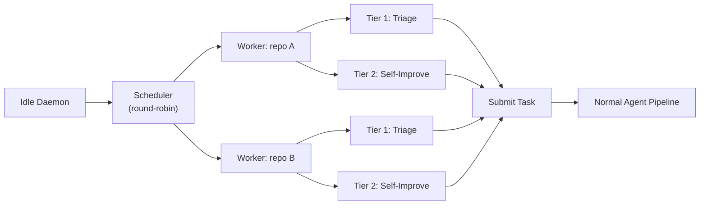
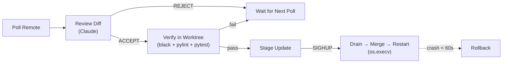

# Operations Guide

> **See also:** The wiki has expanded guides for [Configuration](https://github.com/itsmeboris/Golem/wiki/Configuration), [Heartbeat](https://github.com/itsmeboris/Golem/wiki/Heartbeat), [Dashboard](https://github.com/itsmeboris/Golem/wiki/Dashboard), and [Troubleshooting](https://github.com/itsmeboris/Golem/wiki/Troubleshooting).

This is the operational reference for running Golem in production. It covers
configuration, runtime management, and operational features in depth. For a
project overview and quick start, see the [README](../README.md). For
architecture and agent internals, see [architecture.md](architecture.md).

Detailed reference for Golem's autonomous operational features: heartbeat,
self-update, health monitoring, config management, and SIGHUP reload.

---

## Multi-Repo Support

Golem operates across multiple directories. Register repos with the daemon
using `golem attach`, and ad-hoc tasks default to the caller's current
directory.

### CLI

```bash
golem attach                        # register cwd, heartbeat on
golem attach --no-heartbeat         # register cwd, heartbeat off
golem attach /path/to/dir           # register explicit path
golem detach                        # unregister cwd
golem detach /path/to/dir           # unregister explicit path
```

Attach is idempotent — re-attaching updates settings (e.g., toggle heartbeat).
No daemon restart required; the heartbeat reloads the registry each tick.

### Ad-hoc Tasks

`golem run -p "..."` defaults `work_dir` to the caller's `os.getcwd()`.
Explicit `--cwd /path` still overrides. Issue-based runs (`golem run <id>`)
use the full resolution chain (description directive → subject tag → config
default).

### Registry

Attached repos are stored in `~/.golem/repos.json`. The path is overridable
via the `GOLEM_REGISTRY_PATH` environment variable for testing.

### Git Remote Auto-Detection

On attach, Golem detects `owner/repo` from the git origin remote (SSH and
HTTPS formats). When detected, Tier 1 issue triage uses `gh issue list -R
owner/repo`. Non-git directories skip Tier 1 and run Tier 2 only.

### Graceful Degradation

| Feature | Git repo | Non-git directory |
|---------|----------|-------------------|
| Tier 1 (issues) | Auto-detect | Skipped |
| TODO/FIXME scan | `git log -G` | Skipped |
| Coverage scan | `pytest --cov` | Works |
| Pitfall scan | `AGENTS.md` | Works (if exists) |
| Ad-hoc tasks | Works | Works |
| Worktree isolation | Works | Skipped |

---

## Heartbeat — Self-Directed Work

When the daemon is idle (no external tasks for 15 minutes by default), Golem
starts looking for work on its own across all attached repos.



### Architecture

The `HeartbeatManager` (`golem/heartbeat.py`) is a thin scheduler. Per-repo
scan logic lives in `HeartbeatWorker` (`golem/heartbeat_worker.py`) — one
instance per attached repo.

**Scheduler** — Owns global budget (`daily_spend_usd`), global inflight
tracking, and round-robin index across workers.

**Workers** — Own per-repo state: dedup memory, coverage cache, category
cooldowns, promotion counters, and all scan/tier methods.

### Fair Scheduling

Each tick, the scheduler picks the next worker via round-robin. If a worker
produces no candidates, the scheduler tries the next worker in the same tick —
no wasted cycles. Stops after trying all workers once. At most one task is
submitted per tick.

### Tier 1 — Issue Triage

Scans untagged issues from the auto-detected GitHub remote, runs each through
Haiku to assess automatability, confidence, and complexity. Candidates below
the confidence threshold are skipped. Requires a detected GitHub remote;
skipped for non-git directories.

### Tier 2 — Self-Improvement

Scans the repo for:
- TODOs/FIXMEs in recent git history (git repos only)
- Modules below 100% coverage
- Recurring antipatterns from `AGENTS.md`

Tier 2 candidates are **batched by category** — related fixes (e.g. all
empty-exception-handler fixes) are grouped into a single task, capped at
`heartbeat_batch_size`. This reduces orchestration overhead per line of change.

### Tier 1 Promotion

Per-worker. After every `heartbeat_tier1_every_n` successful Tier 2
completions, the worker's heartbeat forces a GitHub issue submission —
bypassing budget, inflight limits, and complexity filters. A promotion in one
repo doesn't affect another.

### Deduplication

Candidates are deduplicated per-worker with a configurable TTL (default 30
days). The budget is shared globally; dedup memory is per-repo.

### State Persistence

| State | Location |
|-------|----------|
| Global (budget, inflight, round-robin index) | `~/.golem/data/heartbeat_state.json` |
| Per-worker (dedup, coverage, cooldowns, promotion) | `~/.golem/data/heartbeat/<path_hash>.json` |

Both are loaded on daemon startup and saved after each tick. When a repo is detached via `golem detach`, the scheduler calls `HeartbeatWorker.delete_state()` to remove the per-repo state file — preventing stale dedup entries from accumulating for repos that are no longer tracked.

### Configuration

| Setting | Default | Description |
|---------|---------|-------------|
| `heartbeat_enabled` | `false` | Enable self-directed work |
| `heartbeat_interval_seconds` | `300` | Scan frequency (5 min) |
| `heartbeat_idle_threshold_seconds` | `900` | Idle time before activation (15 min) |
| `heartbeat_daily_budget_usd` | `1.0` | Daily spend cap (shared across all repos) |
| `heartbeat_max_inflight` | `1` | Max concurrent heartbeat tasks (global) |
| `heartbeat_candidate_limit` | `5` | Max candidates per scan |
| `heartbeat_batch_size` | `5` | Max Tier 2 candidates per batch submission |
| `heartbeat_tier1_every_n` | `3` | Force a GH issue after N Tier 2 completions (per-worker) |
| `heartbeat_dedup_ttl_days` | `30` | Deduplication memory TTL (per-worker) |

---

## Self-Update — Zero-Downtime Upgrades

The daemon monitors its own Git repository for upstream changes and applies
them automatically with review, verification, and crash-loop protection.



### Update Pipeline

1. Polls the configured remote branch at a configurable interval
2. Reviews the diff with Claude — verdict is ACCEPT or REJECT
3. Runs full verification (`black`, `pylint`, `pytest`) in a temporary worktree
4. On next `SIGHUP`: drains active sessions (up to `drain_timeout_seconds`),
   merges the verified commit, and restarts via `os.execv`
5. If the daemon crashes within 60 seconds of an update twice, it rolls back
   automatically to the pre-update SHA

### Configuration

| Setting | Default | Description |
|---------|---------|-------------|
| `self_update_enabled` | `false` | Enable self-update monitoring |
| `self_update_branch` | `master` | Remote branch to watch |
| `self_update_interval_seconds` | `600` | Poll frequency (10 min) |
| `self_update_strategy` | `merged_only` | `merged_only` (fast-forward) or `any_commit` (hard reset) |

State persists to `~/.golem/data/self_update_state.json` including update
history (last 50 entries) and pre-update SHA for rollback.

### API

`GET /api/self-update` — returns status snapshot with enabled state, branch,
strategy, last check/update timestamps, review verdict, and update history.

---

## SIGHUP Reload

The daemon handles `SIGHUP` gracefully:

1. Stops the tick loop
2. Waits up to `drain_timeout_seconds` (default 300s) for active sessions to
   complete
3. Applies any pending self-update (if staged)
4. Restarts the process via `os.execv()` — picks up fresh config automatically

### Triggering a Reload

```bash
# Automatic — golem config set sends SIGHUP to the running daemon
golem config set heartbeat_enabled true

# Manual
kill -HUP $(cat data/golem.pid)
```

### Configuration

| Setting | Default | Description |
|---------|---------|-------------|
| `daemon.drain_timeout_seconds` | `300` | Grace period for active sessions before forced restart |

---

## Health Monitoring

Real-time daemon health tracking with threshold-based alerting. Fires
notifications through the configured notifier (Slack, Teams, or stdout).

### Monitored Metrics

| Metric | Config Key | Default |
|--------|-----------|---------|
| Consecutive failures | `consecutive_failure_threshold` | `3` |
| Error rate (rolling window) | `error_rate_threshold` | `0.5` (50%) |
| Queue depth | `queue_depth_threshold` | `10` |
| Daemon inactivity | `stale_seconds` | `3600` (1 hour) |
| Disk usage | `disk_usage_threshold_gb` | `0` (disabled) |
| Merge queue blocked | `merge_deferred_threshold` | `5` |

### Status Tiers

- **healthy** — all metrics within thresholds
- **degraded** — one or more warnings (queue depth, high error rate)
- **unhealthy** — critical thresholds breached (consecutive failures, stale daemon, disk usage)

Health status is propagated to the flow engine (`GolemFlow.health_status`,
`GolemFlow.last_health_alerts`). When status reaches **unhealthy**, the
detection loop pauses new task detection until health recovers. Active tasks
continue running — only the polling for new issues is suspended.

### Alert Behavior

Alerts fire through the configured notifier with a 15-minute cooldown
(`alert_cooldown_seconds: 900`) to prevent spam. The `/api/health` endpoint
includes active alerts and current metrics.

### Configuration

| Setting | Default | Description |
|---------|---------|-------------|
| `health.enabled` | `true` | Enable health monitoring |
| `health.check_interval_seconds` | `60` | Check frequency |
| `health.error_rate_window_seconds` | `900` | Rolling window for error rate (15 min) |
| `health.error_rate_min_tasks` | `4` | Min tasks in window before evaluating rate |
| `health.alert_cooldown_seconds` | `900` | Cooldown between repeated alerts |
| `health.merge_deferred_threshold` | `5` | Alert when deferred merges exceed this count |

---

## Merge Queue

The merge queue processes validated work sequentially — each merge rebases onto
HEAD in a disposable worktree, then fast-forwards the main branch.

The queue uses dual locking: an `asyncio.Lock` for async mutation coordination
and a `threading.Lock` for thread-safe reads from dashboard/API endpoints that
may run via `asyncio.to_thread`.

### Deferred Merges

When the working tree is dirty (human editing files while daemon runs), merges
are deferred rather than risking conflicts. Deferred merges retry on subsequent
detection-loop ticks, up to 3 attempts per session. After 3 failures, the
session stops retrying and logs an ERROR.

The health monitor fires `ALERT_MERGE_QUEUE_BLOCKED` when deferred merges
exceed the threshold. This alert is classified as **severe** (unhealthy status).

### Cross-Detection Dedup

The detection loop and heartbeat share a dedup layer — `poll_new_items()`
checks heartbeat's claimed issue IDs before spawning, preventing duplicate
agent sessions for the same GitHub issue.

---

## Config Management

### CLI

```bash
golem config                        # interactive TUI editor
golem config get <field>            # read a single value
golem config set <field> <value>    # update + trigger daemon reload
golem config list                   # list all fields (sensitive values masked)
```

### Interactive TUI

Full-screen editor with:
- Category-based navigation (profile, budget, models, heartbeat, self-update,
  health, integrations, dashboard, daemon, logging, polling)
- Inline editing, choice cycling, boolean toggles
- Unsaved changes tracking
- Live status messages

### Dashboard Config Tab

The web dashboard includes a Config tab with the same category-based layout.
Changes are validated and optionally trigger a daemon reload on save.

### API

| Endpoint | Method | Description |
|----------|--------|-------------|
| `/api/config` | GET | Current config grouped by category with field metadata |
| `/api/config/update` | POST | Validate and apply updates; triggers reload |

### Atomic Writes

Config changes use temp file + rename to prevent corruption. The daemon is
notified via `SIGHUP` to reload without restart.

---

## Checkpoint Resilience

The orchestrator checkpoints task state to disk on every tick. If a checkpoint
file is corrupt (invalid JSON), it is renamed to `.corrupt` alongside the
original path for forensic inspection and logged at ERROR level. The daemon
continues with a fresh session for that task rather than crashing.

---

## Startup Checks

On daemon start, Golem runs two sets of checks before entering the main loop:

### Dependency Validation

`validate_dependencies()` confirms that required tools (`git`, `claude`) are in
`$PATH`. If either is missing, the daemon exits with a clear error message.
Optional tools (`sg` for ast-grep) produce a warning but don't block startup.

### Cleanup

1. **Orphaned worktrees** — `cleanup_orphaned_worktrees()` runs `git worktree prune`,
   then removes any directories under `worktrees/`, `verify-worktrees/`, and
   `bisect-worktrees/` that are not registered git worktrees. This recovers disk
   space from daemon crashes that left worktrees behind.

2. **Data retention** — `cleanup_old_data()` deletes trace files and checkpoints
   older than 30 days. Errors on individual files (permission, TOCTOU races with
   active sessions) are logged and skipped — cleanup never crashes the daemon.

---

## Graceful Shutdown

`SIGINT` / `SIGTERM` triggers `graceful_stop()`:

1. Stop detection loop (no new tasks spawned)
2. Save current state (two-phase atomic write)
3. Cancel timed-out sessions, `await` their `finally` blocks
4. Kill all active CLI subprocesses
5. Final state save

The drain timeout is controlled by `daemon.drain_timeout_seconds` (default 300s).

---

## Notifier Resilience

Both Slack and Teams notifiers retry failed `_send()` calls up to 2 times with
1-second backoff. On final failure, the error is logged at ERROR level but does
not crash the daemon or block the orchestrator.

---

## Pre-Flight Verification

Before spending budget on a task, the supervisor runs `black`, `pylint`, and
`pytest` on the base branch in the worktree.

### Verified Ref Fallback

The daemon tracks the last commit SHA that passed pre-flight. If HEAD fails
verification (e.g., because commits were pushed to master while the daemon is
running), the supervisor falls back to the last-known-good commit instead of
aborting the task.

Flow:
1. Create worktree from HEAD
2. Run pre-flight verification
3. **Pass** → record HEAD SHA as verified, proceed with agent
4. **Fail + verified ref exists** → clean up worktree, recreate from verified
   ref, proceed with warning
5. **Fail + no verified ref** → abort task (same as before)

This prevents cascading failures when the base branch is temporarily broken.

---

## Mutation Testing

Mutation testing verifies that the test suite actually catches bugs — not just
that it achieves line coverage. `mutmut` injects small code mutations (e.g.,
flipping `+` to `-`, changing `True` to `False`) and checks whether any test
fails. Surviving mutants indicate untested behavior.

```bash
# Run mutation testing (slow — one pytest run per mutant)
make mutation

# View results from last run
make mutation-report

# Or directly:
python -m mutmut run
python -m mutmut results
```

mutmut is configured in `pyproject.toml` under `[tool.mutmut]`. The runner
uses `--no-cov --tb=no -x` to keep each per-mutant pytest run as fast as
possible. Results are cached in `.mutmut-cache`; re-running skips already-
tested mutants.

---

## Configuration Reference

### Settings

| Setting | Default | Description |
|---------|---------|-------------|
| `profile` | `local` | Backend profile (`local`, `redmine`, `github`, or custom) |
| `task_model` | `sonnet` | Claude model for task execution and Builder subagents |
| `orchestrate_model` | `opus` | Model for orchestration and review |
| `supervisor_mode` | `true` | Enable subagent orchestration (Agent tool delegation) |
| `budget_per_task_usd` | `10.0` | Max spend per task (0 = unlimited) |
| `task_timeout_seconds` | `3600` | Timeout per task (0 = unlimited) |
| `max_retries` | `1` | Retries on PARTIAL validation verdict |
| `max_active_sessions` | `3` | Concurrent tasks running in parallel |
| `use_worktrees` | `true` | Isolate tasks in separate git worktrees |
| `auto_commit` | `true` | Git commit on PASS |
| `validation_model` | `opus` | Model for the validation agent |
| `preflight_verify` | `true` | Run verifier on base branch before agent starts — catches broken codebases early; falls back to last verified commit if HEAD is broken |
| `ast_analysis` | `true` | Run ast-grep structural rules during validation (requires `sg` binary) |
| `clarity_check` | `false` | Opt-in: score task clarity with haiku before execution |
| `clarity_threshold` | `3` | Minimum clarity score (1–5) to proceed without human clarification |
| `context_injection` | `true` | Auto-inject AGENTS.md + CLAUDE.md from workspace into agent sessions as system prompt context |
| `enable_simplify_pass` | `true` | Run a code-cleanup pass between BUILD and REVIEW phases |
| `verification_timeout_seconds` | `300` | Timeout for black/pylint/pytest verification runs (pre-flight, post-merge, validation) |
| `api_key` | `""` | API key for `/api/*` endpoints; empty = no auth required |
| `ensemble_on_second_retry` | `false` | On second retry, spawn N parallel candidates in separate worktrees with different strategy hints; validate each and commit the best PASS result. Falls back to escalation if no candidate passes |
| `ensemble_candidates` | `2` | Number of parallel candidates for ensemble retry (each runs in its own worktree) |
| `flaky_tests_file` | `""` | Path to known-flaky tests JSON registry; empty = disabled |
| `heartbeat_enabled` | `false` | Enable self-directed work when idle (see [Heartbeat](#heartbeat--self-directed-work)) |
| `heartbeat_daily_budget_usd` | `1.0` | Daily spend cap for heartbeat-spawned tasks |
| `heartbeat_batch_size` | `5` | Max Tier 2 candidates per batch submission |
| `heartbeat_tier1_every_n` | `3` | Force a GH issue after N Tier 2 completions |
| `self_update_enabled` | `false` | Monitor own repo for upstream changes (see [Self-Update](#self-update--zero-downtime-upgrades)) |
| `self_update_branch` | `master` | Remote branch to watch for updates |
| `health.enabled` | `true` | Enable health monitoring with threshold-based alerts |
| `health.merge_deferred_threshold` | `5` | Alert when deferred merges exceed this count |
| `daemon.drain_timeout_seconds` | `300` | Grace period for active sessions during SIGHUP reload |

See [`config.yaml.example`](../config.yaml.example) for the full list including budget limits, timeouts, checkpoint intervals, and merge settings.

### Config Management CLI

```bash
golem config                        # interactive TUI editor
golem config get <field>            # read a single value
golem config set <field> <value>    # update a value + trigger daemon reload
golem config list                   # list all fields (sensitive values masked)
```

Changes made via `golem config set` are written atomically and the daemon is sent `SIGHUP` to pick them up without restart.

### GOLEM_HOME

All Golem global state lives under `~/.golem/`:

```
~/.golem/
├── config.yaml                  # main config (auto-created on first run)
├── repos.json                   # attached repo registry
└── data/
    ├── heartbeat_state.json     # global heartbeat state
    ├── heartbeat/               # per-worker state files
    │   ├── <hash>.json
    │   └── ...
    ├── self_update_state.json   # self-update history
    └── ...
```

Override with the `GOLEM_HOME` environment variable (useful for testing and CI).

Config search order:
1. Explicit `--config` / `-c` CLI argument
2. `~/.golem/config.yaml`
3. `./config.yaml` (cwd fallback)
4. `./config.yml` (cwd fallback)

### Environment Variables

```bash
GOLEM_HOME=/custom/path          # override ~/.golem/ (testing/CI)
GOLEM_REGISTRY_PATH=/custom.json # override repos.json path (testing)
REDMINE_URL=https://redmine.example.com
REDMINE_API_KEY=your-api-key
TEAMS_GOLEM_WEBHOOK_URL=https://...   # optional, or use Slack:
SLACK_GOLEM_WEBHOOK_URL=https://hooks.slack.com/services/T/B/X  # optional
```

### Custom Profiles

<details>
<summary><strong>Writing a custom profile (Jira example)</strong></summary>

Three profiles ship built-in: `local`, `redmine`, and `github`. To create your
own, implement the five protocols from `interfaces.py` and register:

```python
from golem.profile import register_profile, GolemProfile
from golem.backends.local import LogNotifier, NullToolProvider
from golem.prompts import FilePromptProvider

class JiraTaskSource:
    def poll_tasks(self, projects, detection_tag, timeout=30): ...
    def get_task_description(self, task_id): ...

class JiraStateBackend:
    def update_status(self, task_id, status): ...
    def post_comment(self, task_id, text): ...

def _build_jira_profile(config):
    return GolemProfile(
        name="jira",
        task_source=JiraTaskSource(),
        state_backend=JiraStateBackend(),
        notifier=LogNotifier(),
        tool_provider=NullToolProvider(),
        prompt_provider=FilePromptProvider(),
    )

register_profile("jira", _build_jira_profile)
```

Then set `profile: jira` in `config.yaml`.

</details>
