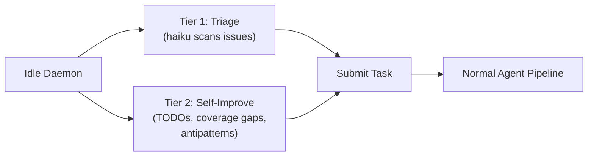
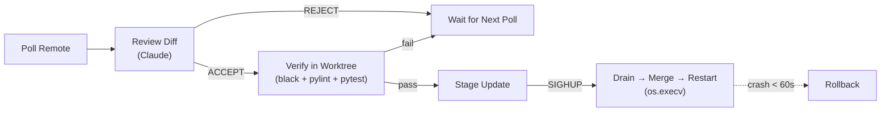

# Operations Guide

This is the operational reference for running Golem in production. It covers
configuration, runtime management, and operational features in depth. For a
project overview and quick start, see the [README](../README.md). For
architecture and agent internals, see [architecture.md](architecture.md).

Detailed reference for Golem's autonomous operational features: heartbeat,
self-update, health monitoring, config management, and SIGHUP reload.

---

## Heartbeat — Self-Directed Work

When the daemon is idle (no external tasks for 15 minutes by default), Golem
starts looking for work on its own.



### Tier 1 — Issue Triage

Scans untagged issues from your task source, runs each through Haiku to assess
automatability, confidence, and complexity. Candidates below the confidence
threshold are skipped.

### Tier 2 — Self-Improvement

Scans the codebase for:
- TODOs/FIXMEs in recent git history
- Modules below 100% coverage
- Recurring antipatterns from `AGENTS.md`

Tier 2 candidates are **batched by category** — related fixes (e.g. all
empty-exception-handler fixes) are grouped into a single task, capped at
`heartbeat_batch_size`. This reduces orchestration overhead per line of change.

### Tier 1 Promotion

After every `heartbeat_tier1_every_n` successful Tier 2 completions, the
heartbeat forces a GitHub issue submission — bypassing budget, inflight limits,
and complexity filters. This ensures real feature work gets attention instead
of endless self-improvement. The promoted task runs as a normal Golem task
(not tracked in heartbeat inflight) and uses the real state backend so issue
close/comment updates reach the tracker.

### Deduplication

Candidates are deduplicated with a configurable TTL (default 30 days). The
dedup memory, inflight task IDs, and daily spend are persisted to
`data/heartbeat_state.json` for recovery across restarts.

### Configuration

| Setting | Default | Description |
|---------|---------|-------------|
| `heartbeat_enabled` | `false` | Enable self-directed work |
| `heartbeat_interval_seconds` | `300` | Scan frequency (5 min) |
| `heartbeat_idle_threshold_seconds` | `900` | Idle time before activation (15 min) |
| `heartbeat_daily_budget_usd` | `1.0` | Daily spend cap for heartbeat tasks |
| `heartbeat_max_inflight` | `1` | Max concurrent heartbeat tasks |
| `heartbeat_candidate_limit` | `5` | Max candidates per scan |
| `heartbeat_batch_size` | `5` | Max Tier 2 candidates per batch submission |
| `heartbeat_tier1_every_n` | `3` | Force a GH issue after N Tier 2 completions |
| `heartbeat_dedup_ttl_days` | `30` | Deduplication memory TTL |

---

## Self-Update — Zero-Downtime Upgrades

The daemon monitors its own Git repository for upstream changes and applies
them automatically with review, verification, and crash-loop protection.



### Update Pipeline

1. Polls the configured remote branch at a configurable interval
2. Reviews the diff with Claude — verdict is ACCEPT or REJECT
3. Runs full verification (`black`, `pylint`, `pytest`) in a temporary worktree
4. On next `SIGHUP`: drains active sessions (up to `drain_timeout_seconds`),
   merges the verified commit, and restarts via `os.execv`
5. If the daemon crashes within 60 seconds of an update twice, it rolls back
   automatically to the pre-update SHA

### Configuration

| Setting | Default | Description |
|---------|---------|-------------|
| `self_update_enabled` | `false` | Enable self-update monitoring |
| `self_update_branch` | `master` | Remote branch to watch |
| `self_update_interval_seconds` | `600` | Poll frequency (10 min) |
| `self_update_strategy` | `merged_only` | `merged_only` (fast-forward) or `any_commit` (hard reset) |

State persists to `data/self_update_state.json` including update history (last
50 entries) and pre-update SHA for rollback.

### API

`GET /api/self-update` — returns status snapshot with enabled state, branch,
strategy, last check/update timestamps, review verdict, and update history.

---

## SIGHUP Reload

The daemon handles `SIGHUP` gracefully:

1. Stops the tick loop
2. Waits up to `drain_timeout_seconds` (default 300s) for active sessions to
   complete
3. Applies any pending self-update (if staged)
4. Restarts the process via `os.execv()` — picks up fresh config automatically

### Triggering a Reload

```bash
# Automatic — golem config set sends SIGHUP to the running daemon
golem config set heartbeat_enabled true

# Manual
kill -HUP $(cat data/golem.pid)
```

### Configuration

| Setting | Default | Description |
|---------|---------|-------------|
| `daemon.drain_timeout_seconds` | `300` | Grace period for active sessions before forced restart |

---

## Health Monitoring

Real-time daemon health tracking with threshold-based alerting. Fires
notifications through the configured notifier (Slack, Teams, or stdout).

### Monitored Metrics

| Metric | Config Key | Default |
|--------|-----------|---------|
| Consecutive failures | `consecutive_failure_threshold` | `3` |
| Error rate (rolling window) | `error_rate_threshold` | `0.5` (50%) |
| Queue depth | `queue_depth_threshold` | `10` |
| Daemon inactivity | `stale_seconds` | `3600` (1 hour) |
| Disk usage | `disk_usage_threshold_gb` | `0` (disabled) |

### Status Tiers

- **healthy** — all metrics within thresholds
- **degraded** — one or more warnings
- **unhealthy** — critical thresholds breached

### Alert Behavior

Alerts fire through the configured notifier with a 15-minute cooldown
(`alert_cooldown_seconds: 900`) to prevent spam. The `/api/health` endpoint
includes active alerts and current metrics.

### Configuration

| Setting | Default | Description |
|---------|---------|-------------|
| `health.enabled` | `true` | Enable health monitoring |
| `health.check_interval_seconds` | `60` | Check frequency |
| `health.error_rate_window_seconds` | `900` | Rolling window for error rate (15 min) |
| `health.error_rate_min_tasks` | `4` | Min tasks in window before evaluating rate |
| `health.alert_cooldown_seconds` | `900` | Cooldown between repeated alerts |

---

## Config Management

### CLI

```bash
golem config                        # interactive TUI editor
golem config get <field>            # read a single value
golem config set <field> <value>    # update + trigger daemon reload
golem config list                   # list all fields (sensitive values masked)
```

### Interactive TUI

Full-screen editor with:
- Category-based navigation (profile, budget, models, heartbeat, self-update,
  health, integrations, dashboard, daemon, logging, polling)
- Inline editing, choice cycling, boolean toggles
- Unsaved changes tracking
- Live status messages

### Dashboard Config Tab

The web dashboard includes a Config tab with the same category-based layout.
Changes are validated and optionally trigger a daemon reload on save.

### API

| Endpoint | Method | Description |
|----------|--------|-------------|
| `/api/config` | GET | Current config grouped by category with field metadata |
| `/api/config/update` | POST | Validate and apply updates; triggers reload |

### Atomic Writes

Config changes use temp file + rename to prevent corruption. The daemon is
notified via `SIGHUP` to reload without restart.

---

## Pre-Flight Verification

Before spending budget on a task, the supervisor runs `black`, `pylint`, and
`pytest` on the base branch in the worktree.

### Verified Ref Fallback

The daemon tracks the last commit SHA that passed pre-flight. If HEAD fails
verification (e.g., because commits were pushed to master while the daemon is
running), the supervisor falls back to the last-known-good commit instead of
aborting the task.

Flow:
1. Create worktree from HEAD
2. Run pre-flight verification
3. **Pass** → record HEAD SHA as verified, proceed with agent
4. **Fail + verified ref exists** → clean up worktree, recreate from verified
   ref, proceed with warning
5. **Fail + no verified ref** → abort task (same as before)

This prevents cascading failures when the base branch is temporarily broken.

---

## Configuration Reference

### Settings

| Setting | Default | Description |
|---------|---------|-------------|
| `profile` | `local` | Backend profile (`local`, `redmine`, `github`, or custom) |
| `task_model` | `sonnet` | Claude model for task execution and Builder subagents |
| `orchestrate_model` | `opus` | Model for orchestration and review |
| `supervisor_mode` | `true` | Enable subagent orchestration (Agent tool delegation) |
| `budget_per_task_usd` | `10.0` | Max spend per task (0 = unlimited) |
| `task_timeout_seconds` | `3600` | Timeout per task (0 = unlimited) |
| `max_retries` | `1` | Retries on PARTIAL validation verdict |
| `max_active_sessions` | `3` | Concurrent tasks running in parallel |
| `use_worktrees` | `true` | Isolate tasks in separate git worktrees |
| `auto_commit` | `true` | Git commit on PASS |
| `validation_model` | `opus` | Model for the validation agent |
| `preflight_verify` | `true` | Run verifier on base branch before agent starts — catches broken codebases early; falls back to last verified commit if HEAD is broken |
| `ast_analysis` | `true` | Run ast-grep structural rules during validation (requires `sg` binary) |
| `clarity_check` | `false` | Opt-in: score task clarity with haiku before execution |
| `clarity_threshold` | `3` | Minimum clarity score (1–5) to proceed without human clarification |
| `context_injection` | `true` | Auto-inject AGENTS.md + CLAUDE.md from workspace into agent sessions as system prompt context |
| `ensemble_on_second_retry` | `false` | Spawn parallel candidates with different strategies on second retry |
| `ensemble_candidates` | `2` | Number of parallel candidates for ensemble retry |
| `flaky_tests_file` | `""` | Path to known-flaky tests JSON registry; empty = disabled |
| `heartbeat_enabled` | `false` | Enable self-directed work when idle (see [Heartbeat](#heartbeat--self-directed-work)) |
| `heartbeat_daily_budget_usd` | `1.0` | Daily spend cap for heartbeat-spawned tasks |
| `heartbeat_batch_size` | `5` | Max Tier 2 candidates per batch submission |
| `heartbeat_tier1_every_n` | `3` | Force a GH issue after N Tier 2 completions |
| `self_update_enabled` | `false` | Monitor own repo for upstream changes (see [Self-Update](#self-update--zero-downtime-upgrades)) |
| `self_update_branch` | `master` | Remote branch to watch for updates |
| `health.enabled` | `true` | Enable health monitoring with threshold-based alerts |
| `daemon.drain_timeout_seconds` | `300` | Grace period for active sessions during SIGHUP reload |

See [`config.yaml.example`](../config.yaml.example) for the full list including budget limits, timeouts, checkpoint intervals, and merge settings.

### Config Management CLI

```bash
golem config                        # interactive TUI editor
golem config get <field>            # read a single value
golem config set <field> <value>    # update a value + trigger daemon reload
golem config list                   # list all fields (sensitive values masked)
```

Changes made via `golem config set` are written atomically and the daemon is sent `SIGHUP` to pick them up without restart.

### Environment Variables

```bash
REDMINE_URL=https://redmine.example.com
REDMINE_API_KEY=your-api-key
TEAMS_GOLEM_WEBHOOK_URL=https://...   # optional, or use Slack:
SLACK_GOLEM_WEBHOOK_URL=https://hooks.slack.com/services/T/B/X  # optional
```

### Custom Profiles

<details>
<summary><strong>Writing a custom profile (Jira example)</strong></summary>

Three profiles ship built-in: `local`, `redmine`, and `github`. To create your
own, implement the five protocols from `interfaces.py` and register:

```python
from golem.profile import register_profile, GolemProfile
from golem.backends.local import LogNotifier, NullToolProvider
from golem.prompts import FilePromptProvider

class JiraTaskSource:
    def poll_tasks(self, projects, detection_tag, timeout=30): ...
    def get_task_description(self, task_id): ...

class JiraStateBackend:
    def update_status(self, task_id, status): ...
    def post_comment(self, task_id, text): ...

def _build_jira_profile(config):
    return GolemProfile(
        name="jira",
        task_source=JiraTaskSource(),
        state_backend=JiraStateBackend(),
        notifier=LogNotifier(),
        tool_provider=NullToolProvider(),
        prompt_provider=FilePromptProvider(),
    )

register_profile("jira", _build_jira_profile)
```

Then set `profile: jira` in `config.yaml`.

</details>
