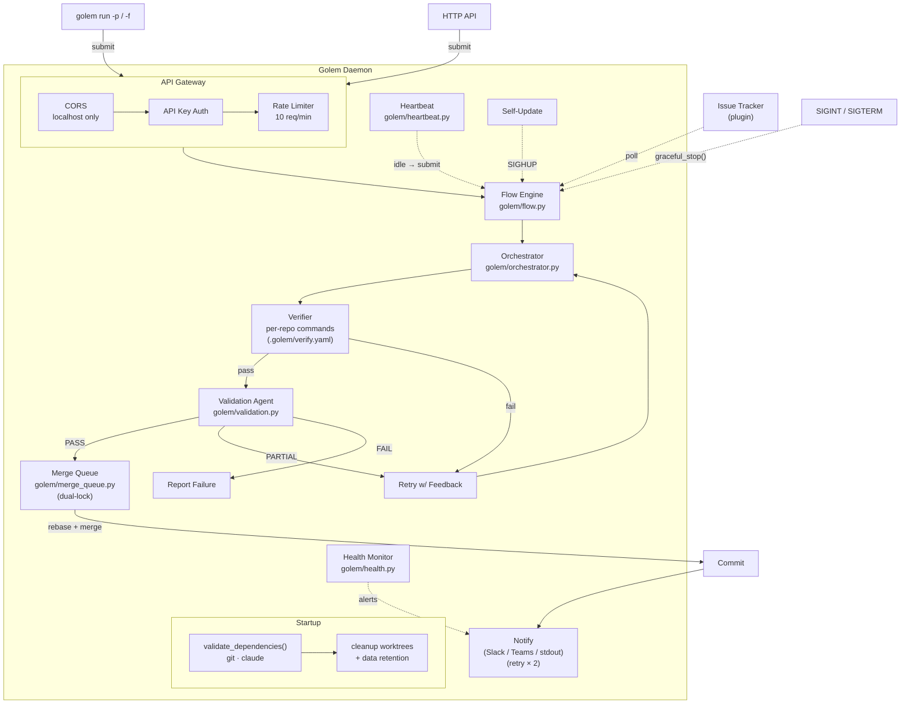
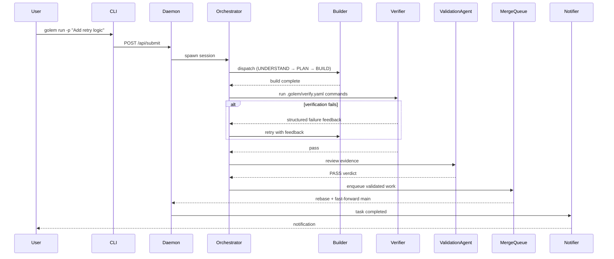
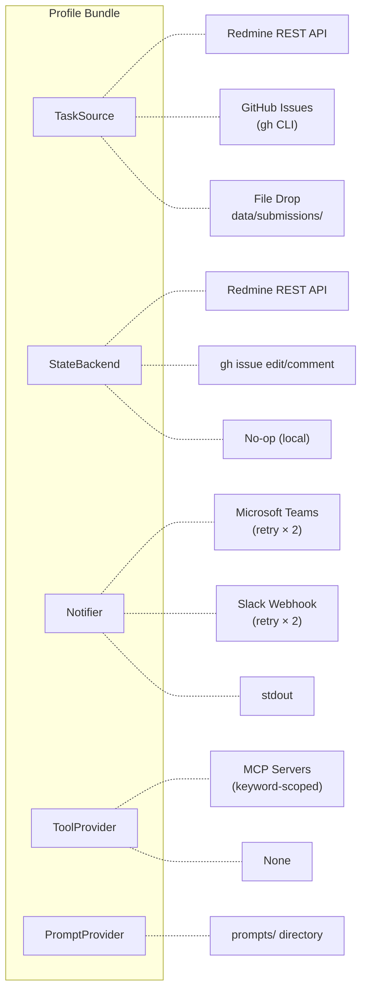
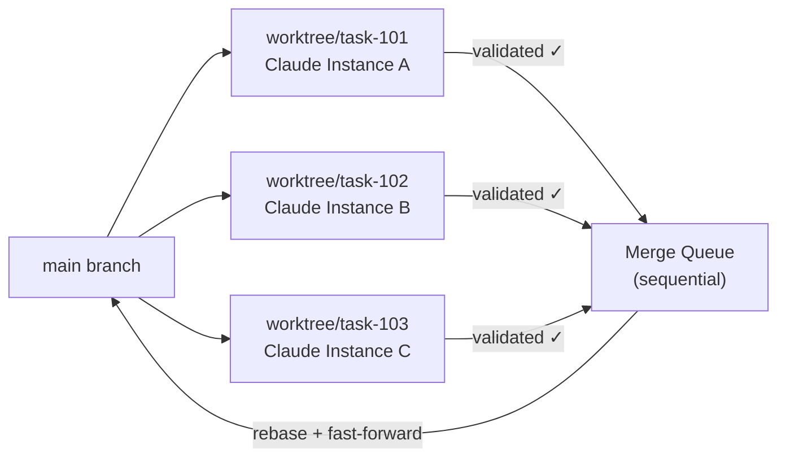

# Architecture

Golem is an autonomous AI coding agent daemon. It polls issue trackers, spawns
Claude sub-agents per task, verifies results, and commits passing work — all
without human intervention. This page is the system-level overview. For deeper
dives, see [[Task Lifecycle|Task-Lifecycle]], [[Sub-Agents]], [[Backends]], and
[[Heartbeat]].

---

## System Overview

All task submission paths converge on a single execution engine regardless of
origin — CLI, HTTP API, issue tracker poll, or self-generated heartbeat work.



The **Flow Engine** (`golem/flow.py`) handles Claude CLI invocation and
event-stream parsing. The **Orchestrator** (`golem/orchestrator.py`) is a
durable state machine that checkpoints on every tick so in-progress tasks
survive daemon restarts. The **Verifier** (`golem/verifier.py`) runs
deterministic checks. The **Validation Agent** (`golem/validation.py`)
dispatches a separate Claude session that reviews evidence and returns a
structured verdict.

---

## Module Map

| Module | Role |
|---|---|
| `golem/orchestrator.py` | Durable state-machine; checkpoints every tick |
| `golem/flow.py` | Agent invocation and event-streaming pipeline |
| `golem/handoff.py` | Structured phase handoff documents between orchestrator phases |
| `golem/validation.py` | Validation agent dispatch and verdict parsing |
| `golem/parallel_review.py` | Multi-perspective reviewer coordination |
| `golem/verifier.py` | Deterministic checks; config-driven generic or Python fallback (black / pylint / pytest) |
| `golem/verify_config.py` | Loads and validates `.golem/verify.yaml` per-repo verification config |
| `golem/detect_stack.py` | Detects repo language/stack to select appropriate verification fallback |
| `golem/observation_hooks.py` | Deterministic signal extraction from verification output |
| `golem/worktree_manager.py` | Git worktree lifecycle for parallel isolation |
| `golem/merge_queue.py` | Sequential merge pipeline with conflict resolution; dual-lock (asyncio + threading) for thread-safe reads |
| `golem/ensemble.py` | Parallel candidate retry strategy on second attempt |
| `golem/event_tracker.py` | Converts stream-json events → `Milestone` objects |
| `golem/types.py` | Shared `TypedDict` contracts — import from here, not inline |
| `golem/clarity.py` | Haiku-based task clarity scoring before execution |
| `golem/context_injection.py` | Injects AGENTS.md + CLAUDE.md into agent sessions; `ContextBudget` fits sections within token limit |
| `golem/knowledge_graph.py` | A-Mem keyword/file-ref indexing of pitfalls for selective, relevance-scored context injection |
| `golem/mcp_validator.py` | Runtime MCP tool schema validation; rejects tools with invalid schemas |
| `golem/prompt_optimizer.py` | Prompt evaluation and optimization suggestions based on historical pass/fail rates |
| `golem/sandbox.py` | OS-level subprocess sandboxing via `resource.setrlimit` (CPU, memory, files, processes) |
| `golem/log_context.py` | Structured logging with `TaskContextFilter` (task_id/phase via contextvars) and `JsonFormatter` |
| `golem/health.py` | Daemon health monitoring with threshold-based alerting |
| `golem/instinct_store.py` | Confidence-weighted pitfall memory with decay/promotion |
| `golem/core/dashboard.py` | Flask web UI for live task monitoring |
| `golem/pitfall_extractor.py` | Extracts + deduplicates pitfalls from session data |
| `golem/pitfall_writer.py` | Categorized write of pitfalls to root `AGENTS.md` |
| `golem/heartbeat.py` | Self-directed work: Tier 1 issue triage, Tier 2 self-improvement, batching, promotion |
| `golem/heartbeat_worker.py` | Per-repo heartbeat scan logic: tiers, dedup, coverage, cooldowns, promotion |
| `golem/repo_registry.py` | Attach/detach registry for multi-repo management (`~/.golem/repos.json`) |
| `golem/batch_cli.py` | Batch submission CLI subcommands (submit, status, list) |
| `golem/data_retention.py` | Startup cleanup of old traces/checkpoints (>30 days) |
| `golem/startup.py` | Startup dependency validation (git, claude in PATH) |
| `golem/backends/` | Issue-tracker adapters (GitHub, Redmine, local, MCP) |
| `golem/prompts/` | Prompt templates for each agent role; `_SafeDict` replaces missing placeholders with `""` |

---

## Data Flow

A task enters Golem through one of four submission methods (see
[[Task Lifecycle|Task-Lifecycle]] for the full state machine). Once submitted,
execution follows the same pipeline regardless of origin:

1. **Submit** — the task lands in the daemon via CLI, HTTP API, batch API, or
   file drop. The daemon probes `/api/health` to confirm readiness before
   accepting CLI submissions.
2. **Orchestrate** — the Orchestrator picks up the task, creates a git
   worktree, and coordinates subagents through five phases (UNDERSTAND → PLAN
   → BUILD → REVIEW → VERIFY).
3. **Verify** — after the BUILD phase, the Verifier runs `black`, `pylint`,
   and `pytest --cov` in the worktree. Failure feeds structured feedback back
   to the Orchestrator for a retry.
4. **Validate** — on verification pass, a separate Validation Agent session
   reviews the evidence and returns a PASS / PARTIAL / FAIL verdict.
5. **Merge** — PASS tasks enter the sequential Merge Queue, which rebases onto
   HEAD in a disposable worktree and fast-forwards the main branch.
6. **Notify** — the configured Notifier (Slack, Teams, or stdout) sends
   lifecycle events.



---

## Profile System

All external integrations are pluggable via **profiles** — bundles of five
backends you can mix and match without changing any application code.



Switch profiles with one line in `config.yaml`:

```yaml
profile: local     # file-based submissions, no external services
profile: redmine   # Redmine issue tracking + Slack/Teams + MCP
profile: github    # GitHub Issues via gh CLI + Slack/Teams
```

| Interface | Purpose | Redmine | Local | GitHub |
|-----------|---------|---------|-------|--------|
| `TaskSource` | Discover and read tasks | Redmine REST API | File drop (`data/submissions/`) | `gh issue list` |
| `StateBackend` | Update status, post comments | Redmine REST API | No-op | `gh issue edit/comment` |
| `Notifier` | Send lifecycle notifications | Slack or Teams | Log to stdout | Slack or Teams |
| `ToolProvider` | Select MCP servers per task | Keyword-based scoping | None | None |
| `PromptProvider` | Load prompt templates | `prompts/` directory | `prompts/` | `prompts/` |

The `local` profile is the recommended starting point. Custom profiles (Jira,
Linear, etc.) can be registered by implementing the five interfaces from
`interfaces.py` and calling `register_profile("name", builder_fn)`. See
`CONTRIBUTING.md` for a full walkthrough.

---

## Parallel Execution

Golem processes multiple tasks simultaneously using git worktrees — lightweight
isolated copies of the repository created by `golem/worktree_manager.py`.



Each task has full read-write access to its own worktree copy. No locks, no
conflicts between tasks. Validated work enters a sequential merge queue that
rebases onto HEAD in a temporary worktree — **the user's working tree is never
touched**. A post-merge integrity check catches silently dropped additions; a
merge agent resolves conflicts automatically.

The number of concurrent worktrees is bounded by `max_active_sessions`
(default: 3). When the working tree is dirty (human editing files while the
daemon runs), merges are deferred rather than risking conflicts, with up to
3 automatic retry attempts per session. The health monitor fires an
`ALERT_MERGE_QUEUE_BLOCKED` alert when deferred merges exceed 5.

---

## Context Injection

Every agent session receives two documents injected as system-prompt context by
`golem/context_injection.py`:

- **`AGENTS.md`** — accumulated learnings, recurring antipatterns, architecture
  notes, and user preferences extracted from past sessions
- **`CLAUDE.md`** — coding conventions, module map, testing requirements, and
  common commands

Between orchestrator phases, `golem/handoff.py` produces structured handoff
documents capturing:

- `from_phase` / `to_phase` markers
- Relevant files discovered during the current phase
- Open questions to carry forward
- Warnings (e.g., files that unexpectedly changed)

This prevents context loss at phase boundaries and allows each subagent to
start with full awareness of prior findings without re-reading the entire
transcript.

---

## Post-Task Learning

After each task completes, Golem automatically updates its own knowledge base:

- **`pitfall_extractor.py`** scans recent session data for validation
  concerns, test failures, and retry summaries, filters noise, and classifies
  each finding into a category.
- **`pitfall_writer.py`** deduplicates findings and atomically writes them to
  `AGENTS.md` under three sections: "Recurring Antipatterns", "Coverage &
  Verification Gaps", and "Architecture Notes".
- **`instinct_store.py`** maintains a confidence-weighted pitfall memory.
  Each observation carries a score (0.0–0.9) that increases on confirmation
  and decreases on contradiction. Observations below 0.2 are auto-archived;
  those above 0.8 are promoted as strong signals.
- **`observation_hooks.py`** extracts deterministic signals from verification
  and validation output — patterns like "blocking I/O in async chain" or
  "no independent verification was run" accumulate and are promoted to pitfalls
  when a frequency threshold is met.

The learning loop runs asynchronously after the session is marked completed.
Failures are logged but never block the pipeline.

---

## Health Monitoring and Flow Control

`golem/health.py` runs periodic checks against configured thresholds and
classifies the daemon as `healthy`, `degraded`, or `unhealthy`.
`GolemFlow` exposes the current status via the `health_status` property and
the most recent alert list via `last_health_alerts`. When the status is
`UNHEALTHY`, the detection loop is paused — no new tasks are picked up until
health recovers — while active sessions continue unaffected.

---

## Retry Resilience

**Ensemble retry** (`golem/ensemble.py`) — when `ensemble_on_second_retry`
is enabled, the second attempt spawns `ensemble_candidates` (default: 2)
parallel builder candidates in isolated worktrees, each with a different
strategy hint. `pick_best_result()` selects the highest-ranked outcome by
verdict (PASS > PARTIAL > FAIL) then confidence.

**Integration validation binary search** — after a batch of tasks merges,
`run_integration_validation()` runs the full validation suite. If it fails,
`_bisect_merges()` binary-searches the ordered merge SHAs by creating
temporary worktrees at the midpoint commit and running `run_verification()`
until the culprit session is identified. The result is reported with the
issue ID and affected files.

---

## Further Reading

- [[Task Lifecycle|Task-Lifecycle]] — state machine, retry logic, checkpoint recovery
- [[Sub-Agents]] — the 5-phase orchestrated pipeline in detail
- [[Backends]] — implementing custom issue-tracker profiles
- [[Heartbeat]] — autonomous self-improvement system
