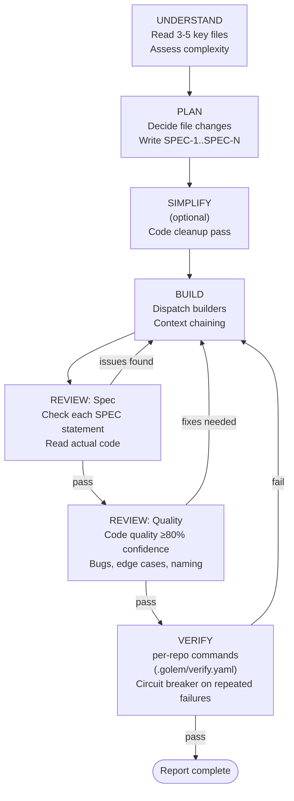
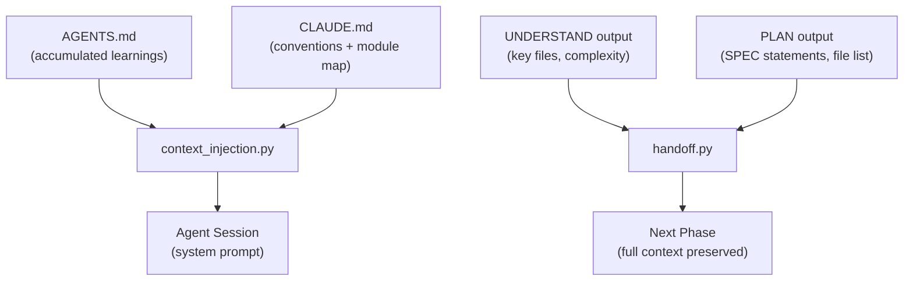

# Sub-Agents

When `supervisor_mode` is enabled (the default), Golem's Orchestrator does not
execute code directly. Instead it coordinates a pipeline of specialized
subagents through five phases. Each phase is a separate assistant turn, which
makes progress visible on the [[Architecture#web-dashboard|web dashboard]] in
real time.

See also: [[Architecture]] for the system overview, [[Task Lifecycle|Task-Lifecycle]]
for the state machine these phases live inside.

---

## Overview

The five-phase pipeline transforms a task description into merged, tested,
reviewed code entirely autonomously. Feedback loops allow the pipeline to
self-correct without human intervention:



When `parallel_review` is enabled, the REVIEW phase dispatches multiple
specialized reviewer subagents concurrently (Spec, Quality, Security,
Consistency, and Test Quality). Results are aggregated by confidence score.

---

## Phase Details

### UNDERSTAND

The Orchestrator reads 3–5 key files directly — no Scout subagent is needed
for most tasks. It invokes relevant workspace skills (e.g., `ast-grep` for
structural search, `test-driven-development` for test conventions) and
assesses task complexity:

| Complexity | Meaning | Effect |
|-----------|---------|--------|
| **trivial** | Single-function change, no new abstractions | Single builder dispatch |
| **standard** | Multi-file change, new function or class | One or two builder dispatches |
| **complex** | New module, protocol change, cross-cutting concern | Multiple builder dispatches with subtask parallelization |

The phase closes by writing a `## Phase: UNDERSTAND` marker to the session
transcript, which the dashboard uses to build the phase-aware timeline.

### PLAN

Using findings from UNDERSTAND, the Orchestrator:

1. Decides exactly which files will change
2. Determines whether subtasks can run in parallel (independent file sets)
3. Writes 3–7 **specification statements** in the format `SPEC-1`, `SPEC-2`,
   etc.

Specification statements are verifiable claims about the intended behavior.
Examples:

```
SPEC-1: retry_request() retries up to max_retries times on 5xx responses
SPEC-2: Each retry waits backoff_seconds * attempt number before retrying
SPEC-3: Retries are not attempted for 4xx responses
SPEC-4: A RetriesExhausted exception is raised after the final failed attempt
SPEC-5: The function is covered by tests for the happy path and all error paths
```

These SPEC statements flow forward into the BUILD phase as builder instructions
and into the REVIEW phase as the checklist the Spec Reviewer verifies against.

### BUILD

The Orchestrator dispatches one or more Builder subagents with:

- The exploration context from UNDERSTAND
- All SPEC statements from PLAN
- Prior builder output (**context chaining** — each builder's summary is
  prepended to the next builder's context, preventing duplicate work)

Builders follow TDD: reproduction test first for bug fixes, new tests first for
new features. Each builder self-verifies before reporting:

```bash
# Builders run these targeted checks — NOT the full suite
pytest path/to/new_test.py -x
black --check path/to/changed_files/
```

The full suite runs only in the VERIFY phase.

For tasks with independent subtasks (non-overlapping file sets), the
Orchestrator can dispatch multiple builders in parallel, each working in the
same worktree but on separate files. The merge is trivial because there are no
shared edits.

### REVIEW: Spec

The Spec Reviewer subagent reads the actual changed code — it does **not** trust
the Builder's self-reported summary. For each SPEC statement, it verifies:

- Is this behavior actually implemented?
- Is it implemented correctly?
- Are there edge cases the spec implies that are missing?

If any SPEC statement fails, the Spec Reviewer returns a detailed issue report
and the Orchestrator dispatches a fix-and-re-review cycle back to BUILD. The
loop continues until all SPEC statements pass.

### REVIEW: Quality

Quality Review only runs after Spec Review passes. The Quality Reviewer checks:

- Code quality and readability
- Potential bugs and error paths
- Edge cases not covered by the spec
- Naming and API design
- Type safety and error handling

The Quality Reviewer only reports issues at **80% confidence or higher** to
avoid noisy false positives. Issues below that threshold are silently discarded.
When `parallel_review` is enabled, this phase also dispatches Security,
Consistency, and Test Quality reviewers concurrently.

### VERIFY

The VERIFY phase runs the full suite — this is the only full run in the entire
workflow:

```bash
black .                          # formatting
pylint --errors-only golem/      # lint (errors only)
pytest --cov=golem --cov-fail-under=100   # tests + 100% coverage
```

A **circuit breaker** stops the retry loop after repeated identical failures
(same error, same file, same line) to prevent infinite loops on truly broken
code. When the circuit opens, the task transitions to FAILED with a clear
explanation.

Failure output is structured and fed back to the BUILD phase with:
- Which tool failed
- Exact error text and line numbers
- Whether this is the same failure as a previous attempt

---

## Agent Roles

| Agent | Model | Tools | Purpose |
|-------|-------|-------|---------|
| **Builder** | sonnet | All tools | Writes code, tests, and fixes issues. Self-verifies with targeted `pytest -x` + `black --check` before reporting. |
| **Spec Reviewer** | opus | Read, Grep, Glob | Verifies implementation matches each SPEC statement by reading actual code. Does not trust Builder self-reports. |
| **Quality Reviewer** | opus | Read, Grep, Glob | Code quality, bugs, edge cases. Only reports issues with >= 80% confidence. |
| **Verifier** | sonnet | Bash | Runs full-suite linters and tests, returns structured pass/fail with exact error output. |
| **Scout** | sonnet | Read, Grep, Glob | Reserved for unknown or very large codebases where the Orchestrator needs targeted exploration help. Most tasks do not need one. |
| **Code Reviewer** | opus | Read, Grep, Glob, Bash | Standalone PR/diff reviewer with confidence-based filtering (>= 80). Read-only — cannot modify files. |

Agent definitions live in `.claude/agents/`. Each definition specifies the
model, available tools, turn limit, and preloaded skills.

---

## Skills System

Skills are reusable packages of domain knowledge, structured workflows, and
search techniques stored in `.claude/skills/`. They are automatically loaded
into agent sessions — agents do not need to discover or fetch them manually.

| Skill | Preloaded by | Purpose |
|-------|-------------|---------|
| `test-driven-development` | Builder | Red-green-refactor workflow, pytest patterns, coverage requirements |
| `systematic-debugging` | Builder | Root-cause investigation before attempting fixes |
| `verification-before-completion` | Verifier | Enforces evidence-based completion claims |
| `ast-grep` | Scout | Structural code search using AST patterns |
| `continual-learning` | (invoked via hooks, not preloaded) | Mine conversation transcripts for durable learnings |

Skills are loaded via `skills` frontmatter in the agent definition file. When
new skills are added to `.claude/skills/`, all agents pick them up
automatically — no prompt changes needed.

---

## Context Flow



**Context injection** (`golem/context_injection.py`) loads `AGENTS.md` and
`CLAUDE.md` from the workspace into every agent session as system-prompt
context. This means every agent starts with:

- Accumulated pitfalls and antipatterns from past sessions
- Project coding conventions (black, pylint, no f-strings in logging)
- Module map and key function locations
- Testing requirements (100% coverage, TDD)

**Structured handoffs** (`golem/handoff.py`) pass state between orchestrator
phases. Each handoff document captures:

```
from_phase: UNDERSTAND
to_phase: PLAN
relevant_files:
  - golem/verifier.py (main verification logic)
  - golem/tests/test_verifier.py (existing tests)
open_questions:
  - Should retry logic live in verifier.py or orchestrator.py?
warnings:
  - golem/flow.py was recently modified — verify no interface changes
```

This prevents context loss at phase transitions and ensures each subagent
starts with full awareness of prior findings without re-reading the entire
session transcript.
